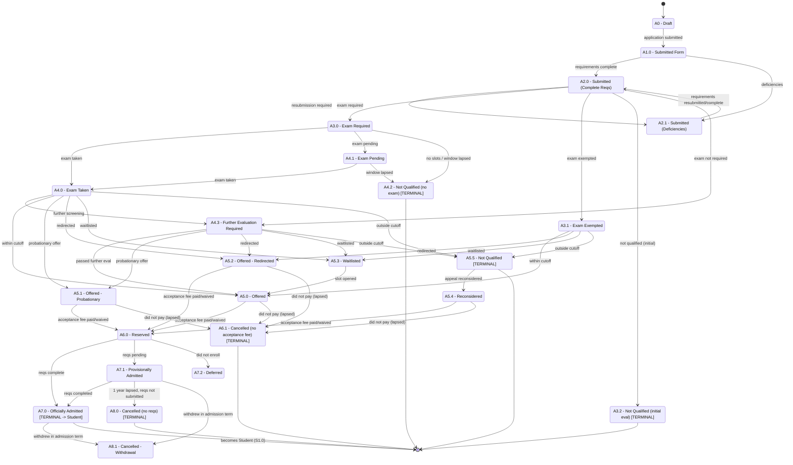

# Applicant / Admission Application Status Flow

**Primary source:** `SEP 19 Post-M3 WIP - Applicant/StudentStatuses` (canonical).
**Compared against:** `SEP 19 M3 - Applicant/StudentStatuses` (earlier draft).

This dimension covers the admission funnel — from creating an applicant account, through application, exam, evaluation, results, and acceptance, until the person is officially admitted and "hands off" into Student Status.

> The tab title states: *"APPLICANT/STUDENT STATUSES — Covers the lifecycle of an Applicant up to early stages as a Student."*

---

## Reading the matrix

Each column is one Admission Application Status. The rows give: the status **code**, **Applicant Status** (Active/Inactive — see deprecation note), the **Student Status / Program Status** it maps to once admitted, **Applicable Levels**, **Process / Time Period**, and **Activities / Events** with AND/OR conditions stacked beneath.

> **Deprecated "Applicant Status: Active/Inactive" row.** In both tabs, the `Applicant Status = Active/Inactive` row is **struck through**, and a Post-M3 note states: *"We will no longer have Inactive status. The conditions here instead are for when Applicant data will be purged."* So the Active/Inactive applicant classification is being dropped; what matters is the Admission Application Status itself.

---

## Applicant status table (canonical, Post-M3 WIP)

| Code | Admission Application Status | Class | Allowed Previous | Levels | Process / Time Period | Trigger (Activities / Events + AND/OR) |
|---|---|---|---|---|---|---|
| A0 | Draft | Transitional | — (start) | IS/UG/GS/SOL | Admission Application | Application drafted (not submitted). |
| A1.0 | Submitted Form | Transitional | A0 | IS/UG/GS/SOL | Admission Application | Application submitted **AND** form submitted within the last 3 terms. |
| A2.0 | Submitted - with Complete Requirements | Transitional | A1.0 or A2.1 | IS/UG/GS/SOL | Admission Application | Mandatory requirements completed. |
| A2.1 | Submitted - with Deficiencies | Transitional | A1.0 or A2.0 | IS/UG/GS/SOL | Admission Application | Pending requirements **OR** OAS/OASIS requires applicant to resubmit. |
| A3.0 | Exam Required | Transitional | A2.0 | IS/UG/GS/SOL | Admission Application | Exam required by strand/program **AND** evaluated by OAS/OASIS **AND** applicant has to undergo exam. |
| A3.1 | Exam Exempted | Transitional | A2.0 | IS/UG/GS/SOL | Admission Application | Exam required by strand/program **AND** evaluated by OAS/OASIS **AND** applicant is exempted. |
| A3.2 | Not Qualified - Did not pass initial evaluation | **Terminal** | A2.0 | IS/UG/GS/SOL | Admission Application | Evaluated by OAS/OASIS **AND** applicant not qualified for admission. |
| A4.0 | Exam Taken | Transitional | A3.0 or A4.1 | IS/UG/GS/SOL | Admission Exam | Applicant has taken the admission exam. |
| A4.1 | Exam Pending | Transitional | A3.0 | IS/UG/GS/SOL | Admission Exam | Has to undergo exam **AND** not yet taken **AND** test slots / reschedule window still open. |
| A4.2 | Not Qualified - Did not take Admission Exam | **Terminal** | A3.0 or A4.1 | IS/UG/GS/SOL | Admission Exam | Not taken **AND** no slots / reschedule period lapsed. |
| A4.3 | Further Evaluation Required | Transitional | A4.0 or A2.0 | IS/UG/GS/SOL | Admission Evaluation | Exam not required **OR** strand/program requires further screening (interview, publication, etc.). |
| A5.0 | Offered | Transitional | A4.0 or A3.1 or A5.3 or A4.3 | IS/UG/GS/SOL | Admission Results | Test scores within cutoff **OR** passed further evaluation. |
| A5.1 | Offered - Probationary | Transitional | A4.0 or A4.3 | IS/GS/SOL | Admission Results | Has additional requirements to maintain stay (extra/bridging subjects, grade requirements, etc.). |
| A5.2 | Offered - Redirected | Transitional | A4.0 or A3.1 or A4.3 | IS/UG/GS/SOL | Admission Results | Did not qualify for chosen strand/program but qualified for another in DLSU. |
| A5.3 | Waitlisted | Transitional | A4.0 or A3.1 or A4.3 | IS/UG/GS/SOL | Admission Results | Qualified but no slots; may be considered if others decline. |
| A5.4 | Reconsidered | Transitional | A5.5 | IS/UG/GS/SOL | Admission Results | Did not qualify **AND** reconsidered after an appeal. |
| A5.5 | Not Qualified | **Terminal** | A4.0 or A3.1 or A4.3 | IS/UG/GS/SOL | Admission Results | Test scores outside cutoff for any strand/program. |
| A6.0 | Reserved | Transitional | A5.0 or A5.1 or A5.2 or A5.4 | IS/UG/GS/SOL | Official Acceptance | Acceptance period not lapsed **AND** Official Acceptance Fee paid **OR** fee waived. |
| A6.1 | Cancelled - Due to non-payment of official acceptance fee | **Terminal** | A5.0 or A5.1 or A5.2 or A5.4 | IS/UG/GS/SOL | Official Acceptance | End of admission term lapsed **AND** did not pay Official Acceptance Fee. |
| A7.0 | Officially Admitted → Student `S1.0`/`S2.0` | **Terminal (admission)** | A6.0, A7.1 | IS/UG/GS/SOL | Official Acceptance | Admission status was Reserved **AND** mandatory requirements for official acceptance completed. |
| A7.1 | Provisionally Admitted → Student `S1.0`/`S2.0` | Transitional | A6.0 (and A7.1) | IS/UG/GS/SOL | Official Acceptance | Admission status was Reserved **AND** mandatory requirements for official acceptance not yet completed. |
| A7.2 | Deferred → Student `Deferred` | Transitional | A6.0 | IS/UG/GS/SOL | Late enrollment period has lapsed | Student Status was Active - Without Enrollment **AND** student did not enroll. |
| A8.0 | Cancelled - Non-submission of Mandatory Requirements for Official Acceptance → Student `S4.0` | **Terminal** | A7.1 | IS/UG/GS/SOL | Within 1 year of Admission Term | 1 year from admission term lapsed **AND** requirements not completed. |
| A8.1 | Cancelled - Withdrawal from University → Student `S4.1` | Transitional/Exit | A7.0 or A7.1 | IS/UG/GS/SOL | Duration of Admission Term | Student enrolled in admission term **AND** decided to withdraw within that term. |

### Hand-off to Student / Program status
On the right side of the matrix, several admission statuses also carry a **Student Status** and **Student Program Status**:

| Admission Status | Student Status | Program Status | Context |
|---|---|---|---|
| A7.0 / A7.1 (Officially / Provisionally Admitted) | `S1.0 Active - Without Enrollment` | `P1.0 Eligible` (or `P1.1 Probationary` if offer was probationary) | Admitted but not yet enrolled. |
| A7.0 / A7.1 after enrolling | `S2.0 Active` | `P1.0`/`P1.1` | Enrolled during admission term. |
| A7.2 | `Deferred` | — | Did not enroll; late-enrollment lapsed. |
| A8.0 | `S4.0` (Cancelled) | `P1.3` (M3 mapping) | Requirements never submitted. |
| A8.1 | `S4.1` (Cancelled - Withdrawal) | — | Withdrew during admission term. |

---

## Terminal states and why they are terminal

| Code | Status | Why terminal |
|---|---|---|
| A3.2 | Not Qualified - Did not pass initial evaluation | Application rejected before exam; no forward path (an appeal would be a new consideration). |
| A4.2 | Not Qualified - Did not take Admission Exam | Exam window/slots lost; cannot proceed. |
| A5.5 | Not Qualified | Failed the cutoff for any program. (Only escape is `A5.4 Reconsidered` via appeal — see ambiguity below.) |
| A6.1 | Cancelled - non-payment of official acceptance fee | Offer lapsed for non-payment. |
| A7.0 | Officially Admitted | Terminal *for the admission application* — the person is now a Student; lifecycle continues in Student Status. |
| A8.0 | Cancelled - non-submission of requirements | Provisional admission expired after 1 year. |

> Note: `A7.0 Officially Admitted` is labeled TERMINAL because the admission *application* is complete — not because the person's journey ends. It is the hand-off into Student Status.

---

## Typical journey (account creation → acceptance or rejection)

1. **A0 Draft** — applicant account created, application drafted.
2. **A1.0 Submitted Form** — application submitted (within last 3 terms).
3. **A2.0 / A2.1** — requirements complete, or deficiencies/resubmission.
4. **A3.0 / A3.1 / A3.2** — exam required, exempted, or rejected at initial evaluation.
5. **A4.0 / A4.1 / A4.2 / A4.3** — exam taken, pending, missed (terminal), or further evaluation.
6. **A5.x** — admission results: Offered / Offered-Probationary / Offered-Redirected / Waitlisted / Reconsidered / Not Qualified (terminal).
7. **A6.0 Reserved** — acceptance fee paid/waived. (`A6.1` if not paid → terminal.)
8. **A7.0 Officially Admitted** (or `A7.1 Provisionally`) — requirements complete; becomes a Student (`S1.0`).
9. **A7.2 Deferred / A8.0 / A8.1** — did not enroll, requirements never submitted, or withdrew.

---

## Mermaid state diagram — applicant flow

---

## Unclear / Needs Confirmation

- **`A5.4 Reconsidered` previous-status loop.** `A5.4`'s only allowed previous is `A5.5 Not Qualified` (a terminal state). So an appeal effectively "revives" a terminal state. Confirm whether `A5.5` should truly be terminal, or whether "Reconsidered" should branch *before* terminal rejection.
- **`A7.1 Provisionally Admitted` self/loop and downstream.** `A7.1` appears both as a status and as an allowed-previous for `A7.0`, `A8.0`, and `A8.1`. The exact transition rules between Provisionally and Officially Admitted (and how many times requirements can be re-checked) need confirmation.
- **Two columns for A7.0 and A7.1.** The matrix lists `A7.0`/`A7.1` twice — once mapping to Student `S1.0 (Active - Without Enrollment)` and once to `S2.0 (Active)`. This duplication encodes "before vs after enrollment," but it is easy to misread; confirm the intended single source of truth.
- **M3 vs Post-M3 terminology rename.** M3 used **"Official Confirmation"** and **"Enrollment Reservation Fee"**; Post-M3 renamed these to **"Official Acceptance"** and **"Official Acceptance Fee."** Confirm the final wording, since `A6.1`'s label still references the fee.
- **Deprecated codes.** M3's `A3.3 Exam Not Required` and `A9.0 Inactive` are struck through and removed in Post-M3 (the "no longer have Inactive status; used for data purge" note). Confirm there are no lingering references.
- **`A5.1 Offered - Probationary` levels.** It is `IS/GS/SOL` (no UG) while almost everything else is `IS/UG/GS/SOL`. Confirm whether undergraduates can receive a probationary offer.
- **"submitted within the last 3 terms" (A1.0).** This time-window condition appears once; confirm it is an actual validity rule for submitted applications.
- **Activity vs status mismatch on A4.3.** `A4.3 Further Evaluation Required` lists both "exam not required" and "further screening required" as triggers; confirm whether these are truly the same status or two distinct situations.
