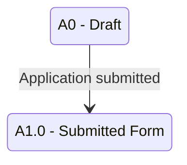

# Naming Conventions for Future Mermaid Diagrams

Apply these rules when generating diagrams from the planning layer.

---

## State IDs

Mermaid state IDs must **not** contain dots, spaces, slashes, or special characters.

| Workbook code | Mermaid ID |
|---|---|
| `A0` | `A0` |
| `A1.0` | `A1_0` |
| `A7.1` | `A7_1` |
| `S2.3` | `S2_3` |
| `P1.4` | `P1_4` |

**Composite / hand-off nodes** (cross-dimension, high-level only):

| Concept | Suggested ID |
|---|---|
| Start | `[*]` (Mermaid built-in) |
| Applicant phase (overview) | `PHASE_APPLICANT` |
| Student phase (overview) | `PHASE_STUDENT` |

---

## State labels

Preserve human-readable code **and** name in the label:

```text
A1_0: A1.0 - Submitted Form
S2_2: S2.2 - Active - Under LOA
P1_3: P1.3 - Strict Probationary (IS only)
```

**Terminal states** — append clearly (Mermaid has no double-circle accepting state):

```text
A3_2: A3.2 - Not Qualified (initial eval) [Terminal]
S4_1: S4.1 - Exited on Good Standing [Terminal]
P3_0: P3.0 - Graduated [Terminal]
```

**Hand-off states** (admission complete → student):

```text
A7_0: A7.0 - Officially Admitted [Terminal for admission app]
```

**Tentative states** (only if explicitly included in a draft diagram):

```text
A5_4: A5.4 - Reconsidered [Tentative - needs confirmation]
```

---

## Transition labels

Short, event-based phrases. **Good:**

```text
Application submitted
Requirements complete
Exam taken
Official acceptance fee paid
LOA approved (within max)
Did not enroll
Returnee approved
Graduation eligibility passed
University exit submitted
```

**Bad** (do not put on arrows):

```text
Admission Application and Requirements evaluated by OAS/OASIS AND Applicant has to undergo Admission Exam
```

For complex logic, use a short label and put AND/OR detail in the transition table **Conditions** column.

---

## Transition IDs (planning layer)

| Prefix | Area |
|---|---|
| `APP-T###` | Applicant status transitions |
| `STU-T###` | Student status transitions |
| `PRG-T###` | Program status transitions |
| `COMBO-T###` | Cross-dimension impacts / combination rules |
| `LIFE-T###` | High-level lifecycle phase transitions |

Reference these IDs in diagram plan files and in future Mermaid comments if helpful.

---

## Diagram file naming (future output)

Suggested pattern when Mermaid files are created:

```text
documentation/diagrams/APP-01_account_to_submission.mmd
documentation/diagrams/STU-02_loa_awol_suspension.mmd
documentation/diagrams/LIFE-01_high_level_overview.mmd
```

Use the **Diagram ID** from [`diagram_index.md`](diagram_index.md) as prefix.

---

## Unknown or unclear items

Do **not** add uncertain transitions to final diagrams. Instead:

1. Record in [`unclear_transitions.md`](unclear_transitions.md).
2. List under **Open Questions** in the relevant part plan.
3. If a draft is needed for discussion, mark the diagram file name with `_TENTATIVE` and label edges `[Tentative]`.

---

## Excluded codes (do not use in diagrams)

Per [`../decisions.md`](../decisions.md):

- `A3.3`, `A9.0`
- `S3.5`, `S3.6`, `S3.7`
- Program `Under Evaluation`
- Combination-tab-only old codes unless diagram is explicitly scoped to the **legacy combination matrix** (see `COMBO-01` notes)

---

## Mermaid type selection

| Use case | Recommended type |
|---|---|
| Status lifecycle within one dimension | `stateDiagram-v2` |
| High-level phases only | `stateDiagram-v2` (composite nodes) |
| Process sequence without stable statuses | `flowchart TD` (rare; prefer tables) |
| Allowed/blocked status pairs | **Markdown table** (not Mermaid) |

### Minimal syntax example (not a final diagram)


