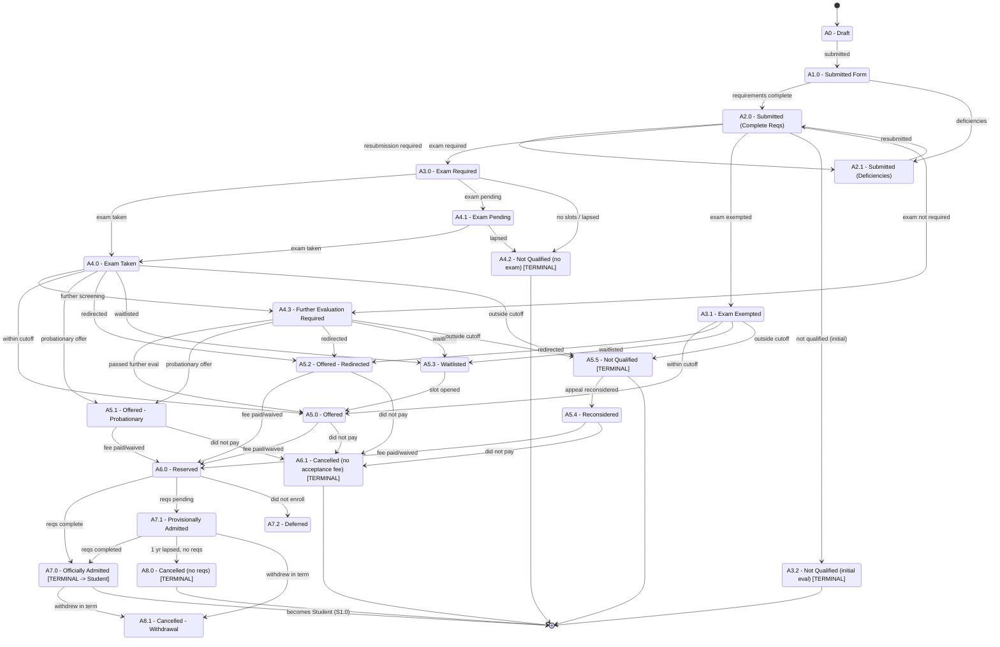
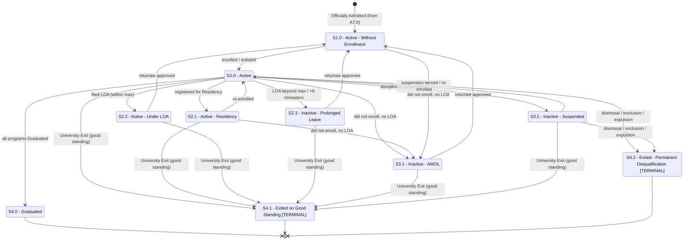
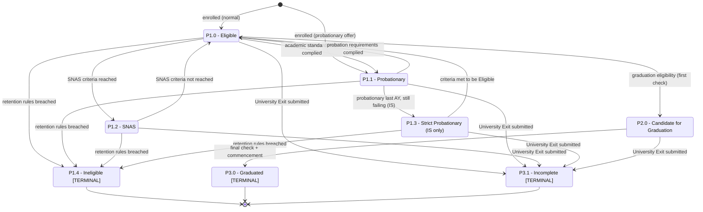
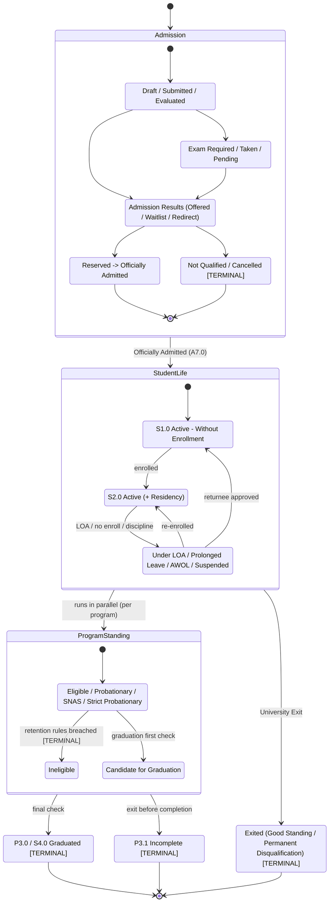

# All Diagrams

All Mermaid diagrams for the DLSU applicant/student journey, collected in one place. Each uses `stateDiagram-v2`. Because Mermaid cannot draw double-circle "accepting" states, **terminal states are labeled `[TERMINAL]`** in their node text.

> Diagrams reflect the **Post-M3 WIP (canonical)** tabs. Transitions are derived from the matrices' "allowed previous status" relationships and condition rows; some directions are interpretations (see the per-flow docs and [`open_questions.md`](open_questions.md)).

---

## 1. Applicant / Admission Application Status flow

---

## 2. Student Status flow

---

## 3. Student Program Status flow

---

## 4. Combined high-level lifecycle flow

A simplified, end-to-end view across all three tracks. Composite states group the detailed statuses above.

> **Note on the combined diagram:** `StudentLife` (student status) and `ProgramStanding` (program status) are *parallel* dimensions per the workbook's "treat separately" recommendation — the arrow between them denotes "run in parallel," not a single transition. Only certain pairings are valid; see [`status_combination_rules.md`](status_combination_rules.md).
