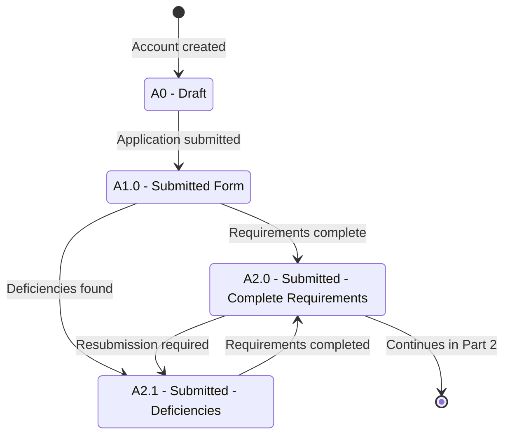

# Applicant Status — Part 1: Account to Submission

## Purpose

Shows the earliest stage of the admission funnel: an applicant account is created, an application is drafted and submitted, and requirements are either completed or flagged as deficient (with a resubmission loop). This diagram stops once the application has complete requirements and is ready for evaluation.

## Machine Type

Finite State Machine / State Transition System using Mermaid `stateDiagram-v2`.

This segment is a clean sequence of discrete application states with a small correction loop, which maps directly to a state machine.

## Source Planning Files

- [`../../diagram_planning/applicant_status_transition_table.md`](../../diagram_planning/applicant_status_transition_table.md) (APP-T001–APP-T006)
- [`../../diagram_planning/applicant_status_part_1_account_to_submission.md`](../../diagram_planning/applicant_status_part_1_account_to_submission.md)

## Mermaid Diagram

## States Included

| Code | Mermaid ID | Label | Type | Notes |
|---|---|---|---|---|
| A0 | A0 | A0 - Draft | Transitional | Entry point after account creation |
| A1.0 | A1_0 | A1.0 - Submitted Form | Transitional | |
| A2.0 | A2_0 | A2.0 - Submitted - Complete Requirements | Transitional | Boundary to Part 2 |
| A2.1 | A2_1 | A2.1 - Submitted - Deficiencies | Transitional | |

## Transition Details

| Transition | Short Label | Full Condition / Explanation | Certainty |
|---|---|---|---|
| `[*]` → A0 | Account created | Admission applicant account created; application drafted (not submitted) | High |
| A0 → A1_0 | Application submitted | Application form submitted (workbook adds "within the last 3 terms") | High |
| A1_0 → A2_0 | Requirements complete | Mandatory requirements for admission application completed | High |
| A1_0 → A2_1 | Deficiencies found | Pending mandatory requirements | High |
| A2_1 → A2_0 | Requirements completed | Applicant resubmits/completes the missing requirements | High |
| A2_0 → A2_1 | Resubmission required | OAS/OASIS requires applicant to resubmit | High |

## Excluded or Unclear Transitions

| Possible Transition | Reason Not Included | What Needs Confirmation |
|---|---|---|
| Any path into A3.x / A4.x / A5.x | Belongs to Part 2 (evaluation/decision) | — |
| A1.0 "within 3 terms" as a rule | Kept in table, not on arrow | Whether the 3-term validity window is enforced |

## Reader Notes

The `A2.0 → [*]: Continues in Part 2` edge is a **boundary marker**, not a real terminal state — it signals that evaluation continues in Part 2. The only loop here is the requirements correction cycle between `A2.0` and `A2.1`.
