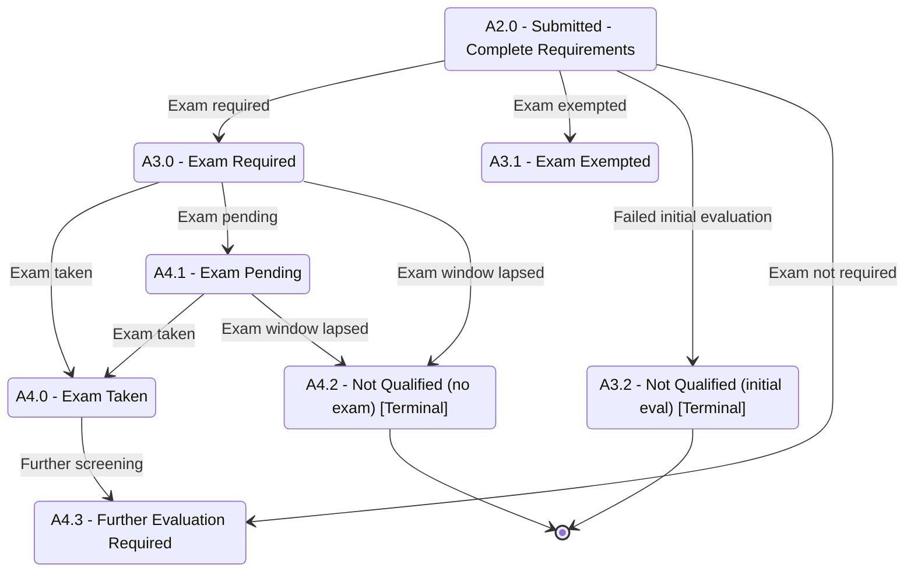
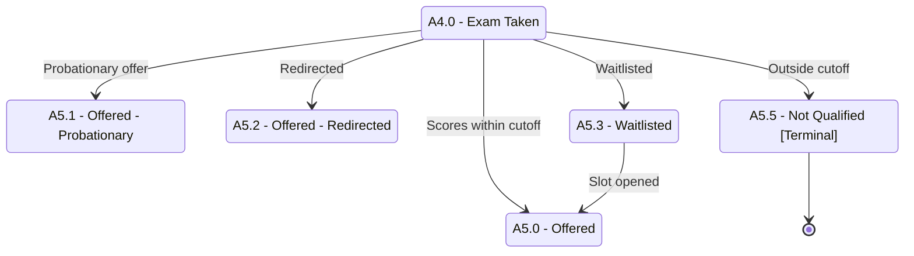

# Applicant Status — Part 2: Evaluation to Decision

## Purpose

Covers the middle of the admission funnel in **two diagrams**: (2A) requirements/exam evaluation, and (2B) admission results (offers, redirect, waitlist, rejection). Split into two because combining all of `A2.0`–`A5.5` would exceed the readable state/transition limits.

## Machine Type

Finite State Machine / State Transition System using Mermaid `stateDiagram-v2`.

Both diagrams are status machines: each box is an admission status and each arrow is a triggered transition.

## Source Planning Files

- [`../../diagram_planning/applicant_status_transition_table.md`](../../diagram_planning/applicant_status_transition_table.md) (APP-T007–APP-T031)
- [`../../diagram_planning/applicant_status_part_2_evaluation_to_decision.md`](../../diagram_planning/applicant_status_part_2_evaluation_to_decision.md)

---

## Diagram 2A — Requirements & Exam Evaluation

## Diagram 2B — Admission Results

Drawn from the representative entry `A4.0 Exam Taken`. The states `A3.1 Exam Exempted` and `A4.3 Further Evaluation Required` feed the **same** result set (see Reader Notes), omitted here only to avoid crossing edges.

## States Included

| Code | Mermaid ID | Label | Type | Notes |
|---|---|---|---|---|
| A2.0 | A2_0 | A2.0 - Submitted - Complete Requirements | Transitional | Entry from Part 1 |
| A3.0 | A3_0 | A3.0 - Exam Required | Transitional | |
| A3.1 | A3_1 | A3.1 - Exam Exempted | Transitional | Also feeds 2B results |
| A3.2 | A3_2 | A3.2 - Not Qualified (initial eval) | Terminal | |
| A4.0 | A4_0 | A4.0 - Exam Taken | Transitional | Representative entry for 2B |
| A4.1 | A4_1 | A4.1 - Exam Pending | Transitional | |
| A4.2 | A4_2 | A4.2 - Not Qualified (no exam) | Terminal | |
| A4.3 | A4_3 | A4.3 - Further Evaluation Required | Transitional | Also feeds 2B results |
| A5.0 | A5_0 | A5.0 - Offered | Transitional | Boundary to Part 3 |
| A5.1 | A5_1 | A5.1 - Offered - Probationary | Transitional | IS/GS/SOL; → program Probationary |
| A5.2 | A5_2 | A5.2 - Offered - Redirected | Transitional | |
| A5.3 | A5_3 | A5.3 - Waitlisted | Transitional | |
| A5.5 | A5_5 | A5.5 - Not Qualified | Terminal | |

## Transition Details

| Transition | Short Label | Full Condition / Explanation | Certainty |
|---|---|---|---|
| A2_0 → A3_0 | Exam required | Evaluated by OAS/OASIS AND exam required by strand/program | High |
| A2_0 → A3_1 | Exam exempted | Evaluated by OAS/OASIS AND applicant exempted | High |
| A2_0 → A3_2 | Failed initial evaluation | Evaluated by OAS/OASIS AND not qualified | High |
| A2_0 → A4_3 | Exam not required | Program does not require an exam | High |
| A3_0 → A4_0 | Exam taken | Applicant has taken the admission exam | High |
| A3_0 → A4_1 | Exam pending | Must undergo exam AND not yet taken AND slots/window open | High |
| A3_0 → A4_2 | Exam window lapsed | Not taken AND no slots / reschedule period lapsed | High |
| A4_1 → A4_0 | Exam taken | Applicant takes the exam during the pending window | High |
| A4_1 → A4_2 | Exam window lapsed | Window/slots lost | High |
| A4_0 → A4_3 | Further screening | Strand/program requires interview/publication/etc. | Medium |
| A4_0 → A5_0 | Scores within cutoff | Test scores within cutoff (or passed further eval) | High |
| A4_0 → A5_1 | Probationary offer | Additional requirements to maintain stay | High |
| A4_0 → A5_2 | Redirected | Qualified for a different strand/program | High |
| A4_0 → A5_3 | Waitlisted | Qualified but no slots | High |
| A4_0 → A5_5 | Outside cutoff | Scores outside cutoff for any strand/program | High |
| A5_3 → A5_0 | Slot opened | Waitlisted applicant considered when others decline | Medium |

## Excluded or Unclear Transitions

| Possible Transition | Reason Not Included | What Needs Confirmation |
|---|---|---|
| A3.1 / A4.3 → A5.x edges | Drawn only from A4.0 to reduce clutter; identical result set | Confirm A3.1/A4.3 reach all A5.x |
| A5.5 → A5.4 Reconsidered | Low certainty; revives a terminal state | Whether appeal should branch before A5.5 |
| A4.3 dual trigger (exam-not-required vs further screening) | Two triggers collapsed to one state | Whether these are truly one status |

## Reader Notes

- **Shared result entries:** per the transition table, `A3.1 Exam Exempted` and `A4.3 Further Evaluation Required` both lead to `A5.0/A5.2/A5.3/A5.5` (and A4.3 also to A5.1). They are omitted from Diagram 2B's arrows purely for legibility; treat `A4.0` as the stand-in entry.
- Terminal states `A3.2`, `A4.2`, `A5.5` are repeated in Part 4 where all terminal/exception states are collected.
