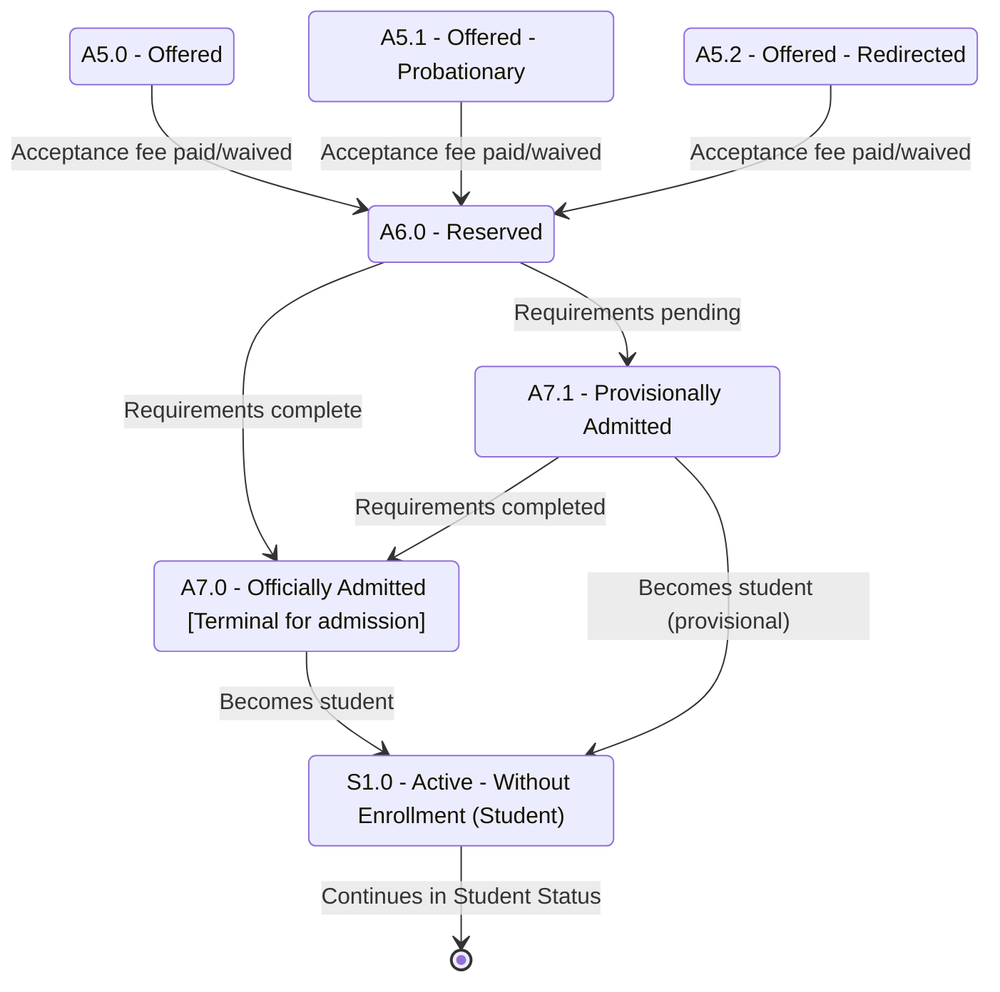

# Applicant Status — Part 3: Acceptance to Student

## Purpose

Shows how an offered applicant reserves a slot, pays the official acceptance fee, completes (or pends) requirements, and is admitted — then hands off into the Student Status dimension at `S1.0 Active - Without Enrollment`. This is where the admission application reaches its successful terminal (`A7.0`) and the person becomes a student.

## Machine Type

Finite State Machine / State Transition System using Mermaid `stateDiagram-v2`.

The acceptance sequence is a status machine; the single arrow into `S1.0` marks the hand-off boundary into the student lifecycle.

## Source Planning Files

- [`../../diagram_planning/applicant_status_transition_table.md`](../../diagram_planning/applicant_status_transition_table.md) (APP-T033–T035, T041–T043, T048–T049)
- [`../../diagram_planning/applicant_status_part_3_acceptance_to_student.md`](../../diagram_planning/applicant_status_part_3_acceptance_to_student.md)

## Mermaid Diagram

## States Included

| Code | Mermaid ID | Label | Type | Notes |
|---|---|---|---|---|
| A5.0 | A5_0 | A5.0 - Offered | Transitional | Entry from Part 2 |
| A5.1 | A5_1 | A5.1 - Offered - Probationary | Transitional | Maps to program Probationary |
| A5.2 | A5_2 | A5.2 - Offered - Redirected | Transitional | |
| A6.0 | A6_0 | A6.0 - Reserved | Transitional | Fee paid/waived |
| A7.0 | A7_0 | A7.0 - Officially Admitted | Terminal (admission) | Hand-off to student |
| A7.1 | A7_1 | A7.1 - Provisionally Admitted | Transitional | Requirements still pending |
| S1.0 | S1_0 | S1.0 - Active - Without Enrollment | Active (student) | Boundary into Student Status |

## Transition Details

| Transition | Short Label | Full Condition / Explanation | Certainty |
|---|---|---|---|
| A5_0/A5_1/A5_2 → A6_0 | Acceptance fee paid/waived | Acceptance period not lapsed AND (fee paid OR waived) | High |
| A6_0 → A7_0 | Requirements complete | Was Reserved AND mandatory requirements for official acceptance completed | High |
| A6_0 → A7_1 | Requirements pending | Was Reserved AND requirements not yet completed | High |
| A7_1 → A7_0 | Requirements completed | Provisional applicant later completes requirements | Medium |
| A7_0 → S1_0 | Becomes student | Officially admitted; not yet enrolled | High |
| A7_1 → S1_0 | Becomes student (provisional) | Provisionally admitted; treated as student awaiting enrollment | High |

## Excluded or Unclear Transitions

| Possible Transition | Reason Not Included | What Needs Confirmation |
|---|---|---|
| A5.4 Reconsidered → A6.0 | Depends on excluded appeal loop | Whether appeal path exists |
| A6.0 → A7.2 Deferred | Belongs to Part 4 (exception states) | Exact deferral precondition |
| A6.0 → A6.1 Cancelled (no fee) | Belongs to Part 4 (terminal) | — |
| A7.0/A7.1 → S2.0 Active (direct) | Medium; matrix duplicate-column ambiguity | Whether enrollment can skip S1.0 |
| A7.1 → A7.1 self-loop | Optional; not reachability-changing | How many re-check cycles allowed |

## Reader Notes

`A7.0` is labeled **Terminal for admission** because the admission *application* is complete there — it is not the end of the person's journey. The `S1.0 → [*]` edge is a boundary marker; the student lifecycle continues in [`../student_status/`](../student_status/README.md). Direct `A7.x → S2.0` enrollment is intentionally not drawn here (see [`../validation/unresolved_diagram_questions.md`](../validation/unresolved_diagram_questions.md)).
