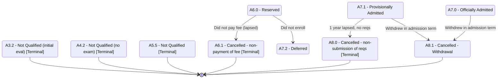

# Applicant Status — Part 4: Terminal & Exception States

## Purpose

Collects the admission outcomes that end or interrupt the funnel: rejections, fee/requirement cancellations, deferral, and withdrawal. This diagram groups the terminal and exception states with their immediate sources so reviewers can see all "dead ends" and off-ramps in one place.

## Machine Type

Finite State Machine / State Transition System using Mermaid `stateDiagram-v2`.

Terminal states are the natural accepting/halting states of the admission FSM; this view isolates them.

## Source Planning Files

- [`../../diagram_planning/applicant_status_transition_table.md`](../../diagram_planning/applicant_status_transition_table.md) (APP-T009, T012, T014, T029–T031, T037–T039, T045–T047, T052)
- [`../../diagram_planning/unclear_transitions.md`](../../diagram_planning/unclear_transitions.md)

## Mermaid Diagram

## States Included

| Code | Mermaid ID | Label | Type | Notes |
|---|---|---|---|---|
| A6.0 | A6_0 | A6.0 - Reserved | Transitional | Source of deferral/cancellation |
| A7.0 | A7_0 | A7.0 - Officially Admitted | Terminal (admission) | Source of withdrawal |
| A7.1 | A7_1 | A7.1 - Provisionally Admitted | Transitional | Source of A8.0/A8.1 |
| A3.2 | A3_2 | A3.2 - Not Qualified (initial eval) | Terminal | From evaluation |
| A4.2 | A4_2 | A4.2 - Not Qualified (no exam) | Terminal | From exam window |
| A5.5 | A5_5 | A5.5 - Not Qualified | Terminal | From results |
| A6.1 | A6_1 | A6.1 - Cancelled - non-payment of fee | Terminal | |
| A8.0 | A8_0 | A8.0 - Cancelled - non-submission of reqs | Terminal | |
| A7.2 | A7_2 | A7.2 - Deferred | Transitional | Did not enroll; offer lapsed |
| A8.1 | A8_1 | A8.1 - Cancelled - Withdrawal | Transitional/Exit | Withdrew during admission term |

## Transition Details

| Transition | Short Label | Full Condition / Explanation | Certainty |
|---|---|---|---|
| A6_0 → A6_1 | Did not pay fee (lapsed) | End of admission term lapsed AND official acceptance fee not paid | High |
| A6_0 → A7_2 | Did not enroll | Student was Active - Without Enrollment AND did not enroll; late-enrollment lapsed | Medium |
| A7_1 → A8_0 | 1 year lapsed, no reqs | 1 year from admission term lapsed AND requirements not completed | High |
| A7_0 → A8_1 | Withdrew in admission term | Enrolled in admission term AND withdrew within that term | High |
| A7_1 → A8_1 | Withdrew in admission term | Same as above, from provisional admission | High |

## Excluded or Unclear Transitions

| Possible Transition | Reason Not Included | What Needs Confirmation |
|---|---|---|
| Re-application after a terminal rejection | Not in the matrix | Whether a new A0 application can start after A3.2/A4.2/A5.5 |
| A8.1 → student exit (S4.1) mapping | Cross-dimension; M3-era mapping unclear in Post-M3 | Student status assigned on withdrawal |
| A8.0 → student status (S4.0) mapping | Cross-dimension; unclear in Post-M3 | Student status on requirement-cancellation |
| A7.2 Deferred → re-entry | Not documented forward | Whether deferred applicants re-enter the funnel |

## Reader Notes

Source states `A3.0`, `A4.1`, `A5.0–A5.2` (which also lead into some of these terminals) are omitted to keep the view focused on the **outcomes**; their edges live in Parts 2–3 and the transition table. `A7.2 Deferred` and `A8.1 Withdrawal` are drawn as non-terminal because the workbook does not explicitly close them with `[*]`; their onward handling is an open question.
