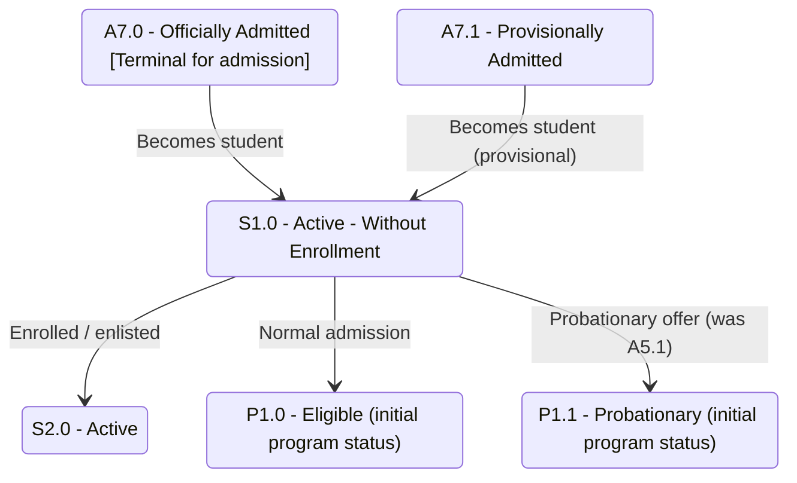

# Applicant-to-Student Bridge

## Purpose

Zooms in on the single most important cross-dimension moment: when an admission application reaches Officially/Provisionally Admitted (`A7.x`) and the person gains a Student Status (`S1.0`) and an initial Program Status (`P1.0`/`P1.1`). This is the hand-off that connects the applicant FSM to the student and program FSMs.

## Machine Type

Finite State Machine / State Transition System using Mermaid `stateDiagram-v2`.

The hand-off is a genuine sequence of state changes across dimensions, so a minimal state machine is appropriate (kept to a few nodes).

## Source Planning Files

- [`../../diagram_planning/applicant_status_transition_table.md`](../../diagram_planning/applicant_status_transition_table.md) (APP-T048–T051)
- [`../../diagram_planning/student_status_transition_table.md`](../../diagram_planning/student_status_transition_table.md) (STU-T001, T010)
- [`../../diagram_planning/student_program_status_transition_table.md`](../../diagram_planning/student_program_status_transition_table.md) (PRG-T001, T002)

## Mermaid Diagram

## States Included

| Code | Mermaid ID | Label | Type | Notes |
|---|---|---|---|---|
| A7.0 | A7_0 | A7.0 - Officially Admitted | Terminal (admission) | End of applicant FSM |
| A7.1 | A7_1 | A7.1 - Provisionally Admitted | Transitional | Requirements pending |
| S1.0 | S1_0 | S1.0 - Active - Without Enrollment | Active (student) | First student status |
| S2.0 | S2_0 | S2.0 - Active | Active (student) | After enrollment |
| P1.0 | P1_0 | P1.0 - Eligible | Active (program) | Initial program status (normal) |
| P1.1 | P1_1 | P1.1 - Probationary | Active (program) | Initial program status (probationary offer) |

## Transition Details

| Transition | Short Label | Full Condition / Explanation | Certainty |
|---|---|---|---|
| A7_0 → S1_0 | Becomes student | Officially admitted; not yet enrolled | High |
| A7_1 → S1_0 | Becomes student (provisional) | Provisionally admitted; treated as student awaiting enrollment | High |
| S1_0 → S2_0 | Enrolled / enlisted | Student enrolls/enlists | High |
| S1_0 → P1_0 | Normal admission | Program standing initialized as Eligible | High |
| S1_0 → P1_1 | Probationary offer | Initialized as Probationary if admission was `A5.1 Offered - Probationary` | High |

## Excluded or Unclear Transitions

| Possible Transition | Reason Not Included | What Needs Confirmation |
|---|---|---|
| A7.0/A7.1 → S2.0 (direct enrollment) | Medium; matrix duplicate-column ambiguity | Whether enrollment in the admission term skips S1.0 |
| A8.x cancellation → student status | Cross-dimension; unclear in Post-M3 | Student status on admission cancellation |

## Reader Notes

This diagram deliberately mixes `A*`, `S*`, and `P*` because its sole purpose is the hand-off. Note that the program-status edges (`S1_0 → P1_0`/`P1_1`) represent **initialization** of a parallel dimension, not a literal student-status transition — when the person becomes a student, each program is assigned a starting standing. Direct `A7.x → S2.0` enrollment is omitted pending confirmation.
