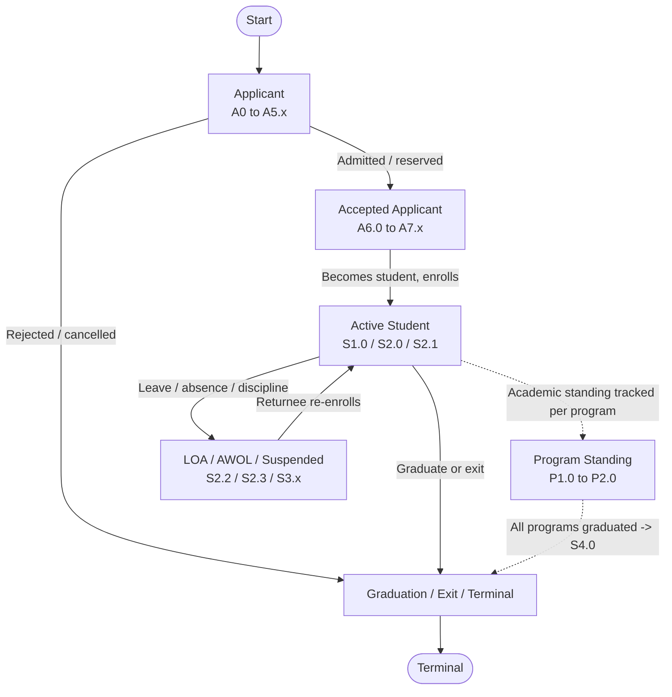

# High-Level Lifecycle Overview

## Purpose

A single, simplified end-to-end view of the journey, from applying to the University through becoming a student to graduation or exit. It shows **broad phases**, not individual status codes, so a newcomer can grasp the whole lifecycle in under a minute.

## Machine Type

Broad Lifecycle Flowchart using Mermaid `flowchart TD`.

A flowchart is used (instead of a strict state machine) because this is a process overview spanning three different status dimensions; formal state semantics would be misleading at this zoom level. Academic program standing runs **in parallel** with active student life, which a flowchart annotation conveys more honestly than a single sequential FSM.

## Source Planning Files

- [`../../diagram_planning/high_level_lifecycle_diagram_plan.md`](../../diagram_planning/high_level_lifecycle_diagram_plan.md) (LIFE-T001–T008)
- [`../../lifecycle_summary.md`](../../lifecycle_summary.md)

## Mermaid Diagram

## Phases Included

| Phase | Node ID | Maps to (reference only) | Type |
|---|---|---|---|
| Applicant | APPLICANT | A0–A5.x | Transitional |
| Accepted Applicant | ACCEPTED | A6.0–A7.x → S1.0 | Transitional |
| Active Student | ACTIVE | S1.0, S2.0, S2.1 | Active |
| Program Standing | PROGRAM | P1.0–P2.0 | Active (parallel) |
| Disruption | DISRUPT | S2.2, S2.3, S3.1, S3.2 | Inactive |
| Graduation / Exit / Terminal | OUTCOME | S4.x, P3.x, P1.4 | Terminal |

## Transition Details

| Transition | Short Label | Full Condition / Explanation | Certainty |
|---|---|---|---|
| START → APPLICANT | Apply to university | Account created, application submitted/evaluated | High |
| APPLICANT → ACCEPTED | Admitted / reserved | Offered then reserved/officially admitted | High |
| APPLICANT → OUTCOME | Rejected / cancelled | Any terminal applicant rejection or cancellation | High |
| ACCEPTED → ACTIVE | Becomes student, enrolls | Officially admitted → S1.0 → enrolled → S2.0 | High |
| ACTIVE ⇢ PROGRAM | Academic standing tracked | Parallel per-program standing (dashed = concurrent, not sequential) | High |
| ACTIVE → DISRUPT | Leave / absence / discipline | LOA, prolonged leave, AWOL, suspension | Medium |
| DISRUPT → ACTIVE | Returnee re-enrolls | Approved returnee re-enrolls | Medium |
| ACTIVE → OUTCOME | Graduate or exit | Graduation or University exit | High |
| PROGRAM ⇢ OUTCOME | All programs graduated | All program statuses Graduated → student S4.0 | High |

## Excluded or Unclear Transitions

| Possible Transition | Reason Not Included | What Needs Confirmation |
|---|---|---|
| Individual A*/S*/P* codes | Detail lives in per-dimension diagrams | — |
| Reconsidered appeal, SAP thresholds | Unclear/deferred | — |
| Combination allowed/blocked pairs | Shown in the interaction file as tables | — |

## Reader Notes

Dashed arrows (`-.->`) indicate the **parallel** relationship between Active Student life and per-program academic standing — they are not sequential transitions. This is the only diagram (with the bridge and interaction files) that deliberately mixes dimensions; all detailed diagrams keep dimensions separate.
