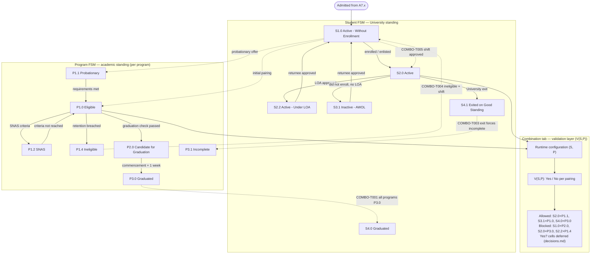

# Parallel Student × Program Constrained FSM

## Purpose

Integrates the two per-dimension finite state machines with the **combination tab** (`SEP 19 - Student/StudentProgramStatusesCombination`) in one readable diagram:

1. **Student FSM** — university-level standing (`S*`)
2. **Program FSM** — academic standing per program (`P*`)
3. **Validation matrix** — which `(S, P)` pairs are allowed (table in docs, summarized in-diagram)
4. **COMBO cross-impacts** — the few cases where one dimension **forces** an update in the other (dotted edges)

This is a **constrained parallel composition**, not a single flat automaton and not a 91-node graph.

## Machine Type

**Parallel FSM + validation constraint layer** using Mermaid `flowchart TB`.

- Solid arrows → within-dimension transitions (see per-dimension part diagrams for full detail)
- Dotted arrows → cross-dimension synchronized updates (`COMBO-T001`, `T003`, `T004`, `T005`)
- Validation box → admissible set from the combination tab (full grid in [`../../status_combination_rules.md`](../../status_combination_rules.md))

## Source Planning Files

- [`../../diagram_planning/status_combination_transition_table.md`](../../diagram_planning/status_combination_transition_table.md)
- [`../../diagram_planning/status_combination_diagram_plan.md`](../../diagram_planning/status_combination_diagram_plan.md)
- [`../../status_combination_rules.md`](../../status_combination_rules.md)
- [`../../decisions.md`](../../decisions.md) (`Yes?` pairs deferred)

## Mermaid Diagram

Copy-paste source: [`../../../final mermaid code/combined_lifecycle/parallel_student_program_constrained_fsm.mmd`](../../../final%20mermaid%20code/combined_lifecycle/parallel_student_program_constrained_fsm.mmd)

## How the three layers work together

| Step | What happens |
|---|---|
| 1 | An event fires (enrollment, LOA, grades, exit, …) |
| 2 | Apply **Student FSM** and/or **Program FSM** (usually one dimension only) |
| 3 | Apply **COMBO** rules if the event is a cross-impact case |
| 4 | Check **V(S,P)** against the combination matrix — reject if `No` |

## Cross-impact Transition Details

| ID | Trigger | Effect | Certainty |
|---|---|---|---|
| COMBO-T001 | All programs `P3.0 Graduated` | Student → `S4.0 Graduated` | High |
| COMBO-T003 | University Exit while program active | Program → `P3.1 Incomplete` | High |
| COMBO-T004 | `P1.4 Ineligible` + shift pending | Student → `S1.0 Without Enrollment` | High |
| COMBO-T005 | Shift application approved | Student → `S2.0 Active` | Medium |

## Excluded from this diagram

| Item | Reason |
|---|---|
| Full 91-cell matrix as edges | Unreadable; see [`../../status_combination_rules.md`](../../status_combination_rules.md) |
| Every student/program state | Simplified backbone; see per-dimension part files |
| `Yes?` pairings | Deferred per [`../../decisions.md`](../../decisions.md) |
| Legacy combination-tab codes | Diagram uses canonical Post-M3 codes |

## Reader Notes

- **Layout:** each FSM is a left-to-right **lane**; the two lanes plus the validation layer stack top-to-bottom. This keeps the diagram from sprawling sideways and shortens the cross-dimension arrows.
- **Solid** edges = same dimension. **Dotted** edges = cross-dimension (COMBO) or initial `(S,P)` pairing at admission.
- The independence of the two dimensions is conveyed by the **separate lanes** (no subgraph-to-subgraph arrow is drawn). AWOL/Suspended students **keeping** program standing (e.g. `S3.1` + `P1.0`) is validated by the matrix — not shown as FSM arrows.
- Minimal COMBO-only insert: [`../../../final mermaid code/combined_lifecycle/cross_impact_rules.mmd`](../../../final%20mermaid%20code/combined_lifecycle/cross_impact_rules.mmd)
