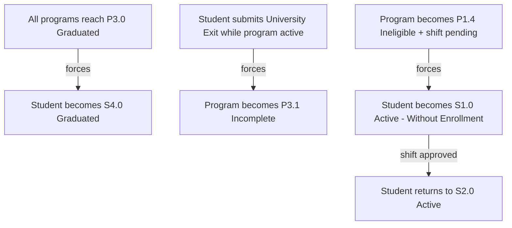

# Student Status vs Student Program Status — Interaction

## Purpose

Explains that **Student Status** (overall standing in the University) and **Student Program Status** (academic standing in a program) are *related but distinct* dimensions tracked separately. Shows the few cases where one **forces** a change in the other, and provides the allowed/blocked combination rules as tables (not a graph).

## Machine Type

Broad Lifecycle Flowchart using Mermaid `flowchart TD` for the cross-impact rules, plus **tables** for the full combination matrix.

A full state machine is misleading here: the two dimensions vary independently, and the combination data is a validation grid (allowed/blocked), not a transition sequence. A 91-cell grid would be unreadable as a graph, so it stays tabular; only the three forced cross-impacts are drawn.

## Source Planning Files

- [`../../diagram_planning/status_combination_transition_table.md`](../../diagram_planning/status_combination_transition_table.md) (COMBO-T001–T004)
- [`../../diagram_planning/status_combination_diagram_plan.md`](../../diagram_planning/status_combination_diagram_plan.md)
- [`../../status_combination_rules.md`](../../status_combination_rules.md)

## Why treat them separately

A student can be `Active` while `Probationary`, or `Suspended` while still academically `Eligible`. The University-level standing (enrollment, leave, discipline, exit) and the program-level standing (grades, retention, graduation) are driven by different processes. Keeping them as separate codes avoids a combinatorial explosion, but only certain pairings are valid — hence a validation matrix.

## Cross-impact flowchart (forced updates only)

## Cross-impact Transition Details

| Transition | Short Label | Full Condition / Explanation | Certainty |
|---|---|---|---|
| All P3.0 → S4.0 | Graduation forces student status | When **all** programs are Graduated, student status becomes Graduated | High |
| Exit → P3.1 | Exit forces program incomplete | University Exit while a program is active (Eligible/Probationary/SNAS) sets the program to Incomplete | High |
| Ineligible + shift → S1.0 | Ineligible triggers without-enrollment | An Ineligible program with a pending shift moves the student to Active - Without Enrollment | High |
| S1.0 → S2.0 (shift approved) | Shift approved | When the shift application is approved, the student returns to Active | Medium |

## Allowed combinations (selected, canonical-mapped)

> Codes follow the **legacy combination tab** scheme; canonical equivalents noted. `Yes?` pairs are treated as **not allowed** (deferred) per [`../../decisions.md`](../../decisions.md).

| Student Status | Program Status | Allowed? | Scenario |
|---|---|---|---|
| S1.0 Active - Without Enrollment | P1.0 Eligible | Yes | Admitted, not enrolled |
| S1.0 Active - Without Enrollment | P1.1 Probationary | Yes | Probationary admission offer |
| S2.0 Active | P1.0 Eligible | Yes | Normal enrolled student |
| S2.0 Active | P1.1 Probationary | Yes | Enrolled, on probation |
| S2.0 Active | P1.2 SNAS | Yes | Enrolled, academic warning |
| S2.0 Active | P1.3 (Ineligible, legacy) | Yes | Only if other programs not Ineligible |
| S2.0 Active | P2.0 Candidate for Graduation | Yes | Completing |
| S3.0 Inactive - Graduated (→ S4.0) | P3.0 Graduated | Yes | The consistent graduate pair |
| S3.1 Inactive - AWOL | P1.0–P1.3 | Yes | Absent student keeps last academic standing |

## Blocked combinations (selected)

| Student Status | Program Status | Allowed? | Reason |
|---|---|---|---|
| S1.0 Active - Without Enrollment | P2.0 Candidate for Graduation | No | Cannot be a graduation candidate before enrolling |
| S2.0 Active | P3.0 Graduated | No | Graduated program forces student to Inactive - Graduated |
| S3.2 Inactive - Exited | P1.0 Eligible | No | Exit converts active program standing to Incomplete |
| Any terminal exit (S3.4–S3.7) | Anything except P3.1 | No | Terminal exits pair only with Incomplete |

## Excluded or Unclear Transitions

| Possible Transition | Reason Not Included | What Needs Confirmation |
|---|---|---|
| Full 91-cell matrix as a graph | Unreadable; kept as tables | — |
| All `Yes?` pairs (e.g. Residency × Probationary) | Deferred per decisions | Stakeholder confirmation |
| LOA + Probationary | Combo tab says Yes, Notes #3 tentatively No | Which source is authoritative |
| Legacy vs canonical code mapping | Schemes differ (`P1.3`, `S3.x`) | Regenerate combination tab with canonical codes |

## Reader Notes

The cross-impact flowchart shows only the three places where one dimension **forces** the other; everywhere else the two dimensions move independently. The combination tables intentionally use the workbook's legacy codes (per the cascade rule in [`../../decisions.md`](../../decisions.md)) — do not mix them with the canonical `P1.3 = Strict Probationary` / `P1.4 = Ineligible` scheme used in the per-dimension diagrams until the tab is reconciled.
