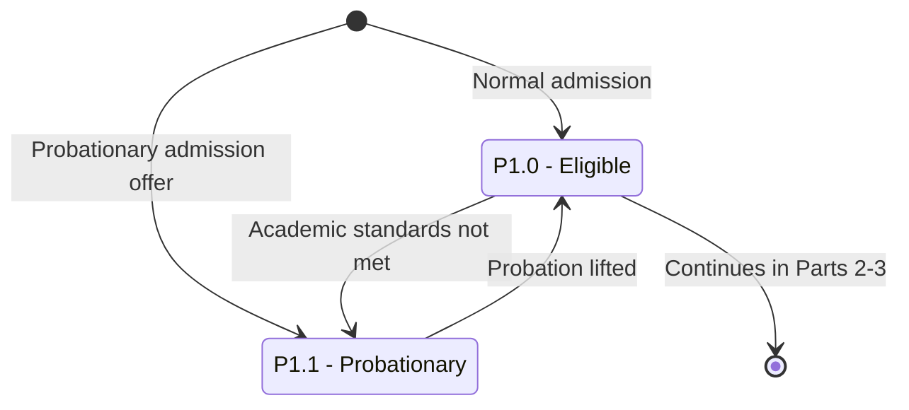

# Student Program Status — Part 1: Good Standing and Probation

## Purpose

Shows how a student enters an academic program — as `P1.0 Eligible` (normal admission) or `P1.1 Probationary` (probationary admission offer) — and how a student moves between eligible and probationary based on academic standards and end-of-year re-evaluation.

## Machine Type

Finite State Machine / State Transition System using Mermaid `stateDiagram-v2`.

Academic standing is a per-program status with clear triggers — a state machine.

## Source Planning Files

- [`../../diagram_planning/student_program_status_transition_table.md`](../../diagram_planning/student_program_status_transition_table.md) (PRG-T001, T002, T012, T013)
- [`../../diagram_planning/student_program_status_part_1_good_standing_to_probation.md`](../../diagram_planning/student_program_status_part_1_good_standing_to_probation.md)

## Mermaid Diagram

## States Included

| Code | Mermaid ID | Label | Type | Notes |
|---|---|---|---|---|
| P1.0 | P1_0 | P1.0 - Eligible | Active | Default starting standing |
| P1.1 | P1_1 | P1.1 - Probationary | Active (warning) | From `A5.1 Offered - Probationary` or failing standards |

## Transition Details

| Transition | Short Label | Full Condition / Explanation | Certainty |
|---|---|---|---|
| `[*]` → P1_0 | Normal admission | Initial status for a normally admitted student | High |
| `[*]` → P1_1 | Probationary admission offer | Admission application status was `Offered - Probationary` | High |
| P1_0 → P1_1 | Academic standards not met | Old student AND academic standards not complied, OR probation requirements not complied | Medium |
| P1_1 → P1_0 | Probation lifted | Criteria met to lift probationary status (end-of-AY re-evaluation) | Medium |

## Excluded or Unclear Transitions

| Possible Transition | Reason Not Included | What Needs Confirmation |
|---|---|---|
| P1.1 → P1.3 Strict Probationary | Belongs to Part 2 | SAP criteria |
| P1.0/P1.1 → P1.2 SNAS | Belongs to Part 2 | — |
| P1.x → P1.4 Ineligible | Belongs to Part 2 | — |
| P1.0 → P2.0 Candidate | Belongs to Part 3 | — |

## Reader Notes

`P1.1 Probationary` has multiple entry triggers (probationary admission, old-student standards failure, unmet probation requirements). They are summarized as two arrows here; the full trigger list is in the transition table. The `P1.0 → [*]` edge is a boundary marker into Parts 2–3.
