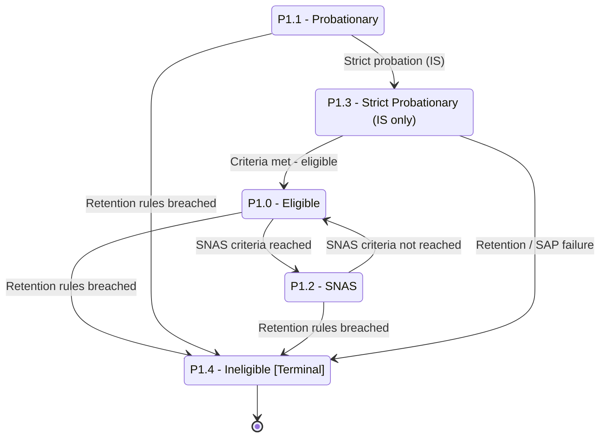

# Student Program Status — Part 2: SNAS, SAP, and Ineligible

## Purpose

Shows the academic-warning and removal standings: SNAS, Strict Probationary (Strict Academic Probation / SAP, IS only), and the terminal Ineligible state. It captures both recovery paths (back to Eligible) and escalation paths (to Ineligible).

## Machine Type

Finite State Machine / State Transition System using Mermaid `stateDiagram-v2`.

These are graded academic standings with recovery and escalation transitions and one terminal sink — a state machine.

## Source Planning Files

- [`../../diagram_planning/student_program_status_transition_table.md`](../../diagram_planning/student_program_status_transition_table.md) (PRG-T010, T011, T014–T019)
- [`../../diagram_planning/student_program_status_part_2_ineligible_and_snas.md`](../../diagram_planning/student_program_status_part_2_ineligible_and_snas.md)

## Mermaid Diagram

## States Included

| Code | Mermaid ID | Label | Type | Notes |
|---|---|---|---|---|
| P1.0 | P1_0 | P1.0 - Eligible | Active | Recovery target |
| P1.1 | P1_1 | P1.1 - Probationary | Active (warning) | Source of SAP escalation |
| P1.2 | P1_2 | P1.2 - SNAS | Active (warning) | "SNAS criteria reached" |
| P1.3 | P1_3 | P1.3 - Strict Probationary (IS only) | Active (warning) | = SAP in handbook |
| P1.4 | P1_4 | P1.4 - Ineligible | Terminal | Retention rules breached |

## Transition Details

| Transition | Short Label | Full Condition / Explanation | Certainty |
|---|---|---|---|
| P1_0 → P1_2 | SNAS criteria reached | Manage Student Success / retention assessment flags SNAS | High |
| P1_2 → P1_0 | SNAS criteria not reached | Recovery when SNAS criteria are no longer met | High |
| P1_1 → P1_3 | Strict probation (IS) | Was Probationary previous AY AND strict requirements not met; IS only (grade threshold deferred) | Medium |
| P1_3 → P1_0 | Criteria met - eligible | Meets criteria to return to Eligible | Medium |
| P1_0 → P1_4 | Retention rules breached | End of term/semester AND program/strand retention rules breached | High |
| P1_1 → P1_4 | Retention rules breached | Same | High |
| P1_2 → P1_4 | Retention rules breached | Same | High |
| P1_3 → P1_4 | Retention / SAP failure | Retention breached, or SAP student fails set criteria ("asked to withdraw" → Ineligible) | Medium |

## Excluded or Unclear Transitions

| Possible Transition | Reason Not Included | What Needs Confirmation |
|---|---|---|
| SAP numeric grade thresholds | Deferred; "below 75 needs to be updated" | Exact SAP grade criteria |
| P1.2 SNAS → P1.1 Probationary | Medium; allowed-previous implies it | SNAS↔Probationary relationship |
| P1.1/P1.2/P1.3 → P2.0 Candidate | P2.0's only documented previous is P1.0 | Whether non-eligible standings can graduate-candidate |

## Reader Notes

`P1.3 Strict Probationary` is **IS only** and follows a prior-year Probationary that was not resolved. Its grade criteria are unconfirmed, so no numbers appear on arrows. `P1.4 Ineligible` is the single terminal sink here; note that an Ineligible student may trigger a separate shifting workflow (see the combination interaction file), which is a cross-dimension effect, not a program-status transition.
