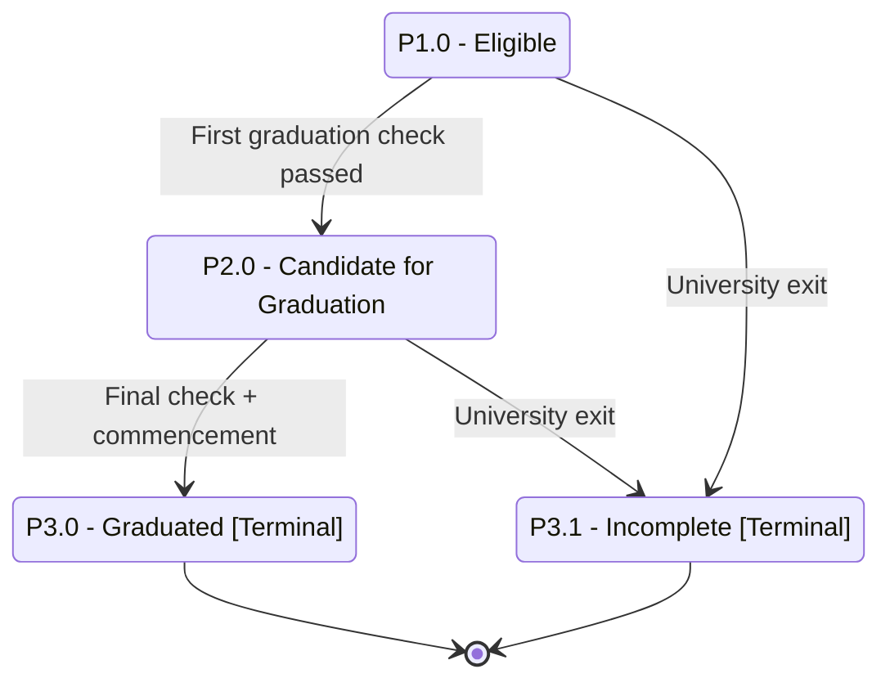

# Student Program Status — Part 3: Graduation and Terminal States

## Purpose

Shows the graduation spine for a program — Eligible → Candidate for Graduation → Graduated — plus the Incomplete terminal that results when a student exits the University before completing the program.

## Machine Type

Finite State Machine / State Transition System using Mermaid `stateDiagram-v2`.

A linear two-step graduation check with a terminal exit branch maps cleanly to an FSM.

## Source Planning Files

- [`../../diagram_planning/student_program_status_transition_table.md`](../../diagram_planning/student_program_status_transition_table.md) (PRG-T030, T031, T040, T044)
- [`../../diagram_planning/student_program_status_part_3_graduation_and_terminal.md`](../../diagram_planning/student_program_status_part_3_graduation_and_terminal.md)

## Mermaid Diagram

## States Included

| Code | Mermaid ID | Label | Type | Notes |
|---|---|---|---|---|
| P1.0 | P1_0 | P1.0 - Eligible | Active | Only documented entry to P2.0 |
| P2.0 | P2_0 | P2.0 - Candidate for Graduation | Active (completing) | After first check |
| P3.0 | P3_0 | P3.0 - Graduated | Terminal | After final check |
| P3.1 | P3_1 | P3.1 - Incomplete | Terminal | University exit before completion |

## Transition Details

| Transition | Short Label | Full Condition / Explanation | Certainty |
|---|---|---|---|
| P1_0 → P2_0 | First graduation check passed | Graduation eligibility rules complied (First Check) | High |
| P2_0 → P3_0 | Final check + commencement | Rules complied AND ~1 week after commencement (attendance not required) | High |
| P1_0 → P3_1 | University exit | University Exit submitted while Eligible | High |
| P2_0 → P3_1 | University exit | University Exit submitted while Candidate | High |

## Excluded or Unclear Transitions

| Possible Transition | Reason Not Included | What Needs Confirmation |
|---|---|---|
| P1.1 / P1.2 / P1.3 → P3.1 Incomplete | High in table, collapsed for clarity | Confirm all standings can become Incomplete on exit |
| P2.0 → P1.0 (failed final check) | Unknown; no documented revert | Path if final graduation check fails |
| P1.1/P1.2/P1.3 → P2.0 | Unknown; P2.0 previous is only P1.0 | Whether warning standings can become Candidate |
| P3.0 → alumni / second degree | Not in matrix | Post-graduation handling |

## Reader Notes

Graduation is a **two-step** process: the First Check produces `P2.0 Candidate`, and the Final Check (about a week after commencement) produces `P3.0 Graduated`. `P3.1 Incomplete` is reachable from any non-terminal standing on University Exit; only the `P1.0` and `P2.0` sources are drawn to keep the graduation spine clear. When **all** of a student's programs reach `P3.0`, the student status becomes `S4.0 Graduated` (cross-dimension — see the interaction file).
