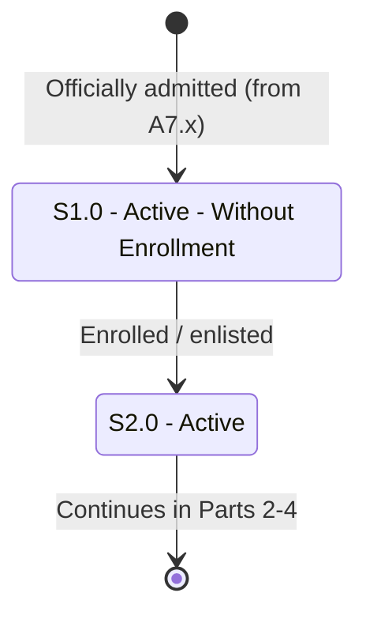

# Student Status — Part 1: Active and Enrollment

## Purpose

Shows the entry into the student lifecycle: an admitted applicant becomes `S1.0 Active - Without Enrollment`, then becomes `S2.0 Active` upon enrollment/enlistment. This is the backbone "healthy student" path that later parts branch off from.

## Machine Type

Finite State Machine / State Transition System using Mermaid `stateDiagram-v2`.

These are discrete student statuses with a clear enrollment trigger — a textbook state transition.

## Source Planning Files

- [`../../diagram_planning/student_status_transition_table.md`](../../diagram_planning/student_status_transition_table.md) (STU-T001/T002, STU-T010)
- [`../../diagram_planning/student_status_part_1_active_and_enrollment.md`](../../diagram_planning/student_status_part_1_active_and_enrollment.md)

## Mermaid Diagram

## States Included

| Code | Mermaid ID | Label | Type | Notes |
|---|---|---|---|---|
| S1.0 | S1_0 | S1.0 - Active - Without Enrollment | Active | Hand-off from admission `A7.0`/`A7.1` |
| S2.0 | S2_0 | S2.0 - Active | Active | The "normal" enrolled student |

## Transition Details

| Transition | Short Label | Full Condition / Explanation | Certainty |
|---|---|---|---|
| `[*]` → S1_0 | Officially admitted | Admission application was Reserved → Officially/Provisionally Admitted; not yet enrolled | High |
| S1_0 → S2_0 | Enrolled / enlisted | Student is enrolled OR enlisted | High |

## Excluded or Unclear Transitions

| Possible Transition | Reason Not Included | What Needs Confirmation |
|---|---|---|
| S2.0 → S2.0 term-break self-loop | Does not change reachability; kept as note | Exact grace-period boundary before AWOL |
| S1.0 → S3.1 AWOL (never enrolled) | Belongs to Part 3 | AWOL-from-S1.0 rules |
| S2.0 → S2.1/S2.2/S2.3 | Belongs to Part 2 | — |

## Reader Notes

There is a documented **term-break grace** behavior where an Active student who has not yet enrolled stays `S2.0` until the late-enrollment window closes. It is a self-loop and is described here rather than drawn, to keep the diagram minimal. The `S2.0 → [*]` edge is a boundary marker into Parts 2–4.
