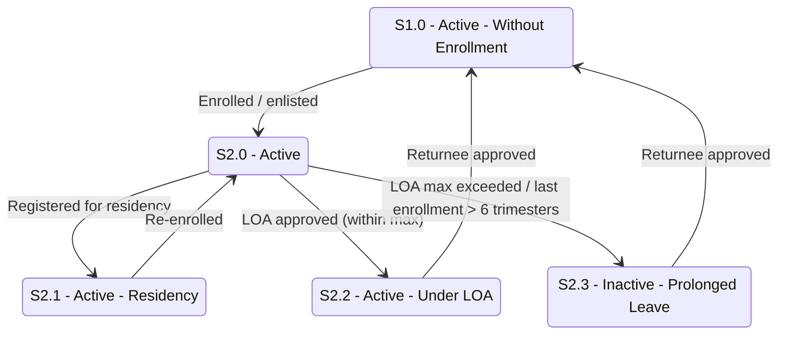

# Student Status — Part 2: Residency and Leave of Absence

## Purpose

Shows the active-but-not-normally-enrolled branches from `S2.0 Active`: residency registration, approved leave of absence (within limits), and prolonged leave (beyond limits). It also shows the returnee path back to `S1.0 Active - Without Enrollment`.

## Machine Type

Finite State Machine / State Transition System using Mermaid `stateDiagram-v2`.

Each leave/residency condition is a distinct student status reachable from Active — a state machine with a return path.

## Source Planning Files

- [`../../diagram_planning/student_status_transition_table.md`](../../diagram_planning/student_status_transition_table.md) (STU-T011–T016)
- [`../../diagram_planning/student_status_part_2_loa_awol_suspension.md`](../../diagram_planning/student_status_part_2_loa_awol_suspension.md)

## Mermaid Diagram

## States Included

| Code | Mermaid ID | Label | Type | Notes |
|---|---|---|---|---|
| S1.0 | S1_0 | S1.0 - Active - Without Enrollment | Active | Returnee re-entry point |
| S2.0 | S2_0 | S2.0 - Active | Active | Branch hub |
| S2.1 | S2_1 | S2.1 - Active - Residency | Active | UG/GS/SOL only |
| S2.2 | S2_2 | S2.2 - Active - Under LOA | Active (on leave) | Within max LOA |
| S2.3 | S2_3 | S2.3 - Inactive - Prolonged Leave | Inactive | Post-M3 addition |

## Transition Details

| Transition | Short Label | Full Condition / Explanation | Certainty |
|---|---|---|---|
| S2_0 → S2_1 | Registered for residency | Student registered for the Residency Activity (UG/GS/SOL) | High |
| S2_1 → S2_0 | Re-enrolled | Returns from residency to normal enrollment | Medium |
| S2_0 → S2_2 | LOA approved (within max) | Filed LOA AND period ≤ max AND last enrollment ≤ 6 trimesters ago | High |
| S2_0 → S2_3 | LOA max exceeded / last enrollment > 6 trimesters | Filed LOA AND period > max AND last enrollment > 6 trimesters ago | High |
| S2_2 → S1_0 | Returnee approved | Approved as returnee (re-enters without enrollment) | Medium |
| S2_3 → S1_0 | Returnee approved | Approved as returnee | Medium |
| S1_0 → S2_0 | Enrolled / enlisted | Returnee enrolls again | High |

## Excluded or Unclear Transitions

| Possible Transition | Reason Not Included | What Needs Confirmation |
|---|---|---|
| S2.2 → S2.3 (LOA → Prolonged) | Low certainty; workbook shows both from S2.0 | Whether prolonged leave passes through S2.2 |
| S2.1 → S2.2 (Residency → LOA) | Unknown certainty | Whether residency students can file LOA |
| S2.2/S2.3 campus & SLC access | Not a transition; policy open | Access rights while on leave (Notes #8) |

## Reader Notes

`S2.2 Under LOA` is classified **Active** (within limits) while `S2.3 Prolonged Leave` is **Inactive** — the difference is leave duration. Both currently originate from `S2.0` in the workbook; whether `S2.2` escalates directly into `S2.3` is unconfirmed (excluded above). Returnee edges are **Medium** because they are inferred from "allowed previous status" rather than an explicit forward trigger.
