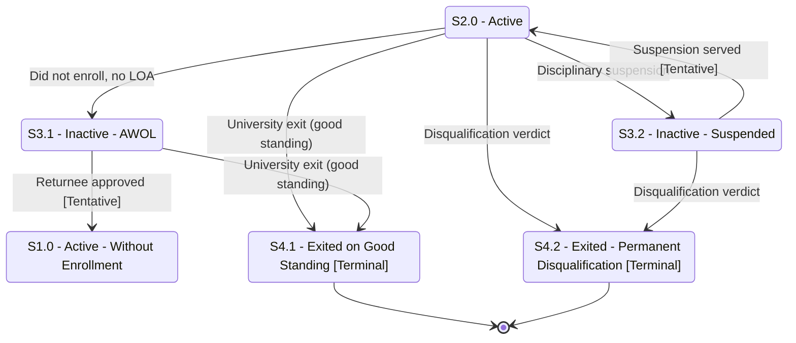

# Student Status — Part 3: AWOL, Suspension, and Exit

## Purpose

Shows the exception and disciplinary branches: a student who does not enroll (and does not file LOA) becomes AWOL; a disciplinary verdict leads to suspension; and either route can end in a University exit (good standing or permanent disqualification). Includes the returnee path out of AWOL.

## Machine Type

Finite State Machine / State Transition System using Mermaid `stateDiagram-v2`.

Disciplinary and absence states with terminal exits are naturally modeled as an FSM with accepting (terminal) states.

## Source Planning Files

- [`../../diagram_planning/student_status_transition_table.md`](../../diagram_planning/student_status_transition_table.md) (STU-T017–T018, T021, T027, T029, T034, T036–T037)
- [`../../diagram_planning/student_status_part_2_loa_awol_suspension.md`](../../diagram_planning/student_status_part_2_loa_awol_suspension.md)

## Mermaid Diagram

## States Included

| Code | Mermaid ID | Label | Type | Notes |
|---|---|---|---|---|
| S1.0 | S1_0 | S1.0 - Active - Without Enrollment | Active | Returnee re-entry |
| S2.0 | S2_0 | S2.0 - Active | Active | Source hub |
| S3.1 | S3_1 | S3.1 - Inactive - AWOL | Inactive | Absent without leave |
| S3.2 | S3_2 | S3.2 - Inactive - Suspended | Inactive | Disciplinary |
| S4.1 | S4_1 | S4.1 - Exited on Good Standing | Terminal | |
| S4.2 | S4_2 | S4.2 - Exited - Permanent Disqualification | Terminal | |

## Transition Details

| Transition | Short Label | Full Condition / Explanation | Certainty |
|---|---|---|---|
| S2_0 → S3_1 | Did not enroll, no LOA | Did not enroll AND did not file LOA AND approved LOA lapsed AND last enrollment ≤ 6 trimesters | High |
| S3_1 → S1_0 | Returnee approved | Approved as returnee (Tentative — inferred from allowed previous) | Medium |
| S2_0 → S3_2 | Disciplinary suspension | Disciplinary verdict given | High |
| S3_2 → S2_0 | Suspension served | Re-enrollment after suspension (Tentative — inferred) | Medium |
| S2_0 → S4_1 | University exit (good standing) | University Exit submitted | High |
| S3_1 → S4_1 | University exit (good standing) | University Exit submitted from AWOL | High |
| S2_0 → S4_2 | Disqualification verdict | Verdict: non-readmission, dismissal/exclusion, or expulsion | High |
| S3_2 → S4_2 | Disqualification verdict | From suspension to permanent disqualification | High |

## Excluded or Unclear Transitions

| Possible Transition | Reason Not Included | What Needs Confirmation |
|---|---|---|
| S2.1/S2.2/S2.3 → S3.1 / S3.2 | Drawn only from S2.0 to reduce clutter | Whether residency/LOA/prolonged-leave feed AWOL/suspension identically |
| Many → S4.1 (S2.1, S2.2, S2.3, S3.2) | Collapsed; only S2.0 and S3.1 drawn | Confirm all listed allowed-previous exits |
| S3.2 Suspended → S4.1 good standing | Unusual; in allowed-previous list | Can a suspended student exit on good standing? |
| S4.2 → reinstatement | No documented return | Whether disqualification is ever reversible |

## Reader Notes

Returnee (`S3.1 → S1.0`) and suspension-return (`S3.2 → S2.0`) edges are marked **[Tentative]** because they are reverse-engineered from "allowed previous status" data, not explicit forward triggers. Several states (`S2.1`, `S2.2`, `S2.3`) can also submit a University Exit to `S4.1`; those edges are collapsed here and fully listed in Part 4 and the transition table.
