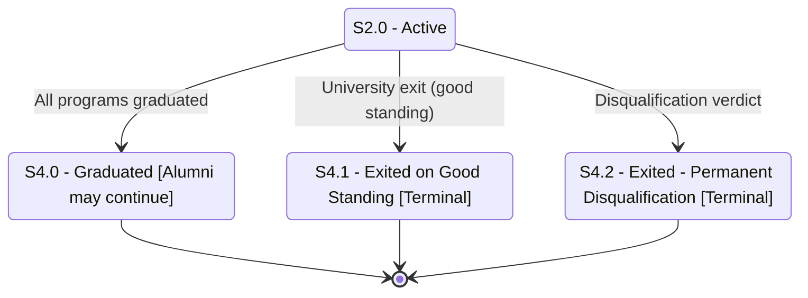

# Student Status — Part 4: Graduation and Terminal States

## Purpose

Collects the end-of-journey student outcomes in one view: graduation (driven by all programs reaching Graduated) and the two terminal exits. It shows which active states can reach each terminal and clarifies the terminal labeling.

## Machine Type

Finite State Machine / State Transition System using Mermaid `stateDiagram-v2`.

This is the accepting-state view of the student FSM.

## Source Planning Files

- [`../../diagram_planning/student_status_transition_table.md`](../../diagram_planning/student_status_transition_table.md) (STU-T028–T037, T052)
- [`../../diagram_planning/student_status_part_3_exit_and_graduation.md`](../../diagram_planning/student_status_part_3_exit_and_graduation.md)

## Mermaid Diagram

Copy-paste source: [`../../../final mermaid code/student_status/part_4_graduation_and_terminal_states.mmd`](../../../final%20mermaid%20code/student_status/part_4_graduation_and_terminal_states.mmd)

## States Included

| Code | Mermaid ID | Label | Type | Notes |
|---|---|---|---|---|
| S2.0 | S2_0 | S2.0 - Active | Active | Primary source |
| S4.0 | S4_0 | S4.0 - Graduated | Non-terminal (enrollment) | Workbook omits TERMINAL; alumni/BS→MS may continue |
| S4.1 | S4_1 | S4.1 - Exited on Good Standing | Terminal | |
| S4.2 | S4_2 | S4.2 - Exited - Permanent Disqualification | Terminal | |

## Transition Details

| Transition | Short Label | Full Condition / Explanation | Certainty |
|---|---|---|---|
| S2_0 → S4_0 | All programs graduated | Program status of all programs is Graduated (`P3.0`) — cross-dimension trigger | High |
| S2_0 → S4_1 | University exit (good standing) | University Exit submitted | High |
| S2_0 → S4_2 | Disqualification verdict | Disciplinary: non-readmission, dismissal/exclusion, or expulsion | High |

## Excluded or Unclear Transitions

| Possible Transition | Reason Not Included | What Needs Confirmation |
|---|---|---|
| S4.0 → further enrollment (BS/MS) | Modeled as "Alumni may continue" label; details TBD | Exact ladderized/alumni re-enrollment rules (Notes #6) |
| Graduated + clearance hold | Not modeled as a status (Notes #7) | Whether a separate "graduated-with-hold" status is needed |
| Other states → S4.1 (S1.0, S2.1, S2.2, S2.3, S3.1, S3.2) | Collapsed to S2.0 for clarity | Confirm full allowed-previous exit list |

## Reader Notes

`S4.0 Graduated` is labeled **`[Alumni may continue]`** per executive default (corrections #7, #21): the workbook does **not** mark the *student* status Graduated as TERMINAL, and graduates may re-enroll (e.g. BS→MS). It is routed to `[*]` here for diagram completeness only — unlike `S4.1`/`S4.2`, it is **not** a hard terminal in the business model. The single source `S2.0` is shown; the exit (`S4.1`) is reachable from many states per the transition table.
