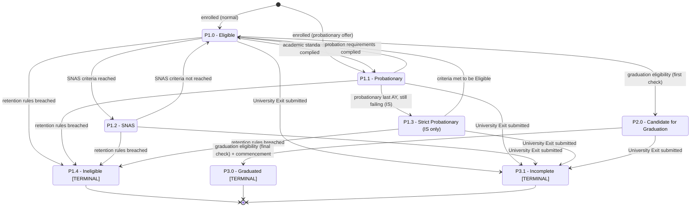

# Student Program Status Flow

**Primary source:** `SEP 26 Post-M3 WIP - StudentProgramStatuses` (canonical).
**Compared against:** `SEP 26 M3 - StudentProgramStatuses` (earlier draft).

This dimension covers the student's **academic standing within a specific academic program**. A student can be enrolled in more than one program, so this status is tracked **per program**. Per the Notes tab, *"Academic Standing directly impacts the Student Program Status."*

> The tab title states: *"STUDENT PROGRAM STATUSES — covers the lifecycle of the student in their Academic Program."*

---

## Program status table (canonical, Post-M3 WIP)

| Code | Program Status | Class | Allowed Previous | Levels | Process / Time Period | Trigger (Activities / Events + AND/OR) |
|---|---|---|---|---|---|---|
| P1.0 | Eligible | Active | Initial status or P1.1 or P1.2 | IS/UG/GS/SOL | Manage Grades **OR** Manage Student Success | SNAS criteria not reached. |
| P1.1 | Probationary | Active (warning) | Initial status or SNAS | IS/UG/GS/SOL | Official Acceptance **OR** End of Previous AY (eligibility assessment) | Admission was Offered - Probationary **OR** (old student **AND** academic standards not complied) **OR** (Probationary requirements not complied / academic standards not complied). |
| P1.2 | SNAS | Active (warning) | Eligible | IS/UG/GS/SOL | Manage Student Success **OR** Determine Student Retention | SNAS criteria reached. |
| P1.3 | Strict Probationary | Active (warning) | Probationary | **IS only** | Duration of Academic Year / End of Previous AY | Was Probationary in previous AY **AND** Strict Probationary requirements not complied / academic standards not complied. = SAP in handbook. |
| P1.4 | Ineligible | **Terminal** | SNAS, Probationary, Eligible, Strict Probationary | IS/UG/GS/SOL | Manage Student Success **OR** Determine Student Retention | End of Term/Semester **AND** Program/strand retention rules breached. |
| P2.0 | Candidate for Graduation | Active (completing) | P1.0 | IS/UG/GS/SOL | Assess Graduation Eligibility - First Check **OR** Final Check | Graduation eligibility rules complied. |
| P3.0 | Graduated | **Terminal** | P2.0 | IS/UG/GS/SOL | 1 week after commencement exercise | Graduation eligibility rules complied **AND** 1 week after commencement has passed (attendance not required). |
| P3.1 | Incomplete | **Terminal** | P1.0 or P1.1 or P1.2 or P1.3 or P2.0 | IS/UG/GS/SOL | Duration of any Term/Semester | University Exit submitted. |

### Deprecated in M3 (struck through; removed in Post-M3)
| M3 item | What happened |
|---|---|
| `P1.4 Under Evaluation` (with "Student registered an application to shift" / "Shifting application not yet completed") | Removed. Shifting is handled via the "Manage Shifting Application" *process* (Notes #5), not a program status. |

> **Important numbering conflict.** The **M3 program tab** and the **combination tab** map `P1.2 = SNAS`, `P1.3 = Ineligible`, and have *no* code for Strict Probationary. The **canonical Post-M3 tab** maps `P1.2 = SNAS`, `P1.3 = Strict Probationary`, `P1.4 = Ineligible`. Anyone reading the combination tab must use the older mapping. See [`open_questions.md`](open_questions.md).

---

## The seven academic standings explained

| Status | Meaning | Terminal? |
|---|---|---|
| **Eligible** (`P1.0`) | Student is in good academic standing and may continue in the program. Reached when SNAS criteria are *not* reached. | No |
| **Probationary** (`P1.1`) | Student did not fully meet academic requirements (or was admitted on a probationary offer). Must satisfy probation requirements. | No |
| **SNAS** (`P1.2`) | A student-success/academic flag reached when "SNAS criteria reached." (Acronym not expanded in the workbook — see [`glossary.md`](glossary.md).) | No |
| **Strict Probationary / SAP** (`P1.3`) | "Strict Academic Probation" — for students who were probationary the previous AY and still did not meet the criteria. **IS only.** | No |
| **Ineligible** (`P1.4`) | Student breached program/strand retention rules; removed from the program. | **Yes** |
| **Candidate for Graduation** (`P2.0`) | Passed the first graduation eligibility check; awaiting final check. | No |
| **Graduated** (`P3.0`) | Passed the final check (~1 week after commencement). | **Yes** |
| **Incomplete** (`P3.1`) | Student exited the University before completing the program. | **Yes** |

**Differences to be careful about:**
- **Eligible vs Probationary vs SNAS vs Strict Probationary** — all are non-terminal *active* program standings, ordered roughly by academic risk: Eligible (good) → Probationary (warning) → SNAS / Strict Probationary (heightened warning). SNAS and Strict Probationary are distinct concepts: SNAS comes from "SNAS criteria," while Strict Probationary specifically follows a prior-year Probationary that wasn't resolved (IS only).
- **Ineligible vs Incomplete** — Ineligible = removed for breaching academic retention rules (academic outcome). Incomplete = the student exited the University while still in the program (administrative/exit outcome). Both terminal.
- **Candidate for Graduation vs Graduated** — a two-step check: First Check → Candidate (`P2.0`), Final Check → Graduated (`P3.0`). Only `P2.0` may precede `P3.0`.

---

## How academic performance and rules drive program status

| Driver | Effect |
|---|---|
| Admission offer was probationary | Starts at `P1.1 Probationary`. |
| Normal admission | Starts at `P1.0 Eligible` ("Initial status"). |
| SNAS criteria reached | `P1.0 → P1.2 SNAS`. |
| SNAS criteria not reached (recovery) | `P1.2 → P1.0 Eligible`. |
| Probation requirements not complied (end of AY) | `P1.0/P1.1 → P1.1 Probationary` (stay/return to probation). |
| Probationary last AY + still failing (IS) | `P1.1 → P1.3 Strict Probationary`. |
| Program/strand retention rules breached | `→ P1.4 Ineligible` (terminal). |
| Graduation eligibility (first check) | `P1.0 → P2.0 Candidate for Graduation`. |
| Graduation eligibility (final check) + commencement passed | `P2.0 → P3.0 Graduated` (terminal). |
| University Exit submitted | `→ P3.1 Incomplete` (terminal). |

---

## Mermaid state diagram — student program status flow

> Recovery transitions (e.g. `P1.2 → P1.0`, `P1.1 → P1.0`, `P1.3 → P1.0`) are inferred from the *allowed previous statuses* and the Background notes' "treatment of probationary students" rules, which describe re-evaluation at the end of the academic year. The matrix itself lists allowed-previous relationships rather than explicit forward arrows.

---

## Current State vs Future State Notes

The Post-M3 program tab contains an extensive **"Background"** block (cells C25–C63) capturing the design discussion. Summarized faithfully:

### 1. Future state — agreement in previous sessions
- **"Probationary" is for "new students."**
- Students get a probationary status if they **did not fully meet the academic requirements** at the admission-application stage.
- **Note:** *for IS, Probationary applies to both new and old students.*

### 2. Current state — based on the IS Student Handbook
- **"Strict Academic Probation (SAP)"** is the complete name in the handbook.
- **SAP is for "old students" only.**
- A student becomes SAP if: they were *probationary in the previous academic year*, **and** they *did not meet the SAP grade criteria* (the workbook flags *"'below 75' needs to be updated"* — the exact grade threshold is **not finalized**).
- Worked example given (authors note "kindly confirm if correct"):
  - Grade 1 — *bumagsak* (failed)
  - Grade 2 — probationary status (AND failed Grade 2)
  - Grade 3 — SAP
- **Treatment of probationary students** — re-evaluated at end of academic year:
  - new student + probationary + criteria met to lift → remove probationary status
  - new student + probationary + criteria met to change to SAP → SAP
  - old student + probationary + criteria met to change to SAP → SAP
  - old student + probationary + criteria met to be eligible → Eligible
- **Treatment of SAP students:** if a SAP student does not meet the set criteria, *"student will be asked to withdraw"* — the authors note this *"should be ineligible"* (i.e. map to `P1.4 Ineligible`).
  - Example: *"during Grade 3, student did not meet the set criteria, student to withdraw."*

### 3. Open design decision — how to model Strict Probationary
The authors explicitly weighed two options:
- **Option 1 — keep "Strict Probationary" as a separate status from "Probationary."**
  - Pro: a Strict-Probationary student is easily identifiable.
  - Con: one additional status.
- **Option 2 — incorporate "strict probationary" under `P1.1 Probationary`.**
  - Pro: fewer, simplified statuses.
  - Con: the gravity of strict probation is not highlighted; treatment rules become more complex.
- A sample rule was drafted: *"If Probationary, and student is from IS, and Student Program Status was Probationary in the previous academic year, and the student did not comply with the requirements of the Academic Probation contract in the previous academic year, then treat as strict probationary."*

> **Interpretation:** The canonical Post-M3 tab effectively chose **Option 1** — `P1.3 Strict Probationary` exists as a separate, IS-only status. This remains marked as a discussion point (yellow highlight) and should be confirmed.

### Other current/future-state notes (from the program tab's M3 → Post-M3 cleanup)
- M3 had a transient **"Under Evaluation"** status tied to shifting applications; this was **removed** in favor of treating shifting as a process.
- M3 process labels ("Duration of first Term/Semester (or Year?)") show unresolved timing questions; Post-M3 reframed the header as **"Process / Time Period — Timing of Implementation."**
