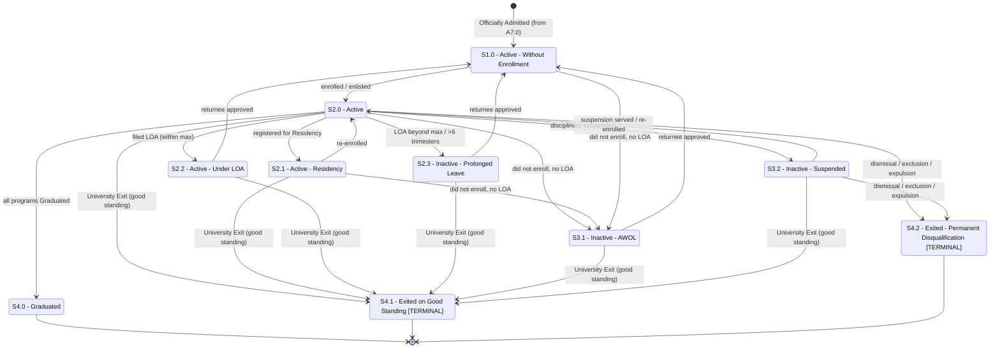

# Student Status Flow

**Primary source:** `SEP 19 Post-M3 WIP - StudentStatuses` (canonical).
**Compared against:** `SEP 19 M3 - StudentStatuses` (earlier draft).

This dimension covers the student's **overall standing in the University** once admitted — independent of how they are doing inside any specific academic program (that is the [program status](student_program_status_flow.md)).

> The tab title states: *"STUDENT STATUSES — covers the lifecycle of the student during their stay in the University."*

From the Notes tab:
> *"Student status is either Active or Inactive."* If **Active**, the student has access to campus and the SLC system; if **Inactive**, access to campus / SLC is limited. An Active student should also have a **'standing'** (Good vs Bad/Poor), affected by academic, disciplinary, and financial/payment factors.

---

## Student status table (canonical, Post-M3 WIP)

| Code | Status | Active/Inactive/Terminal | Allowed Previous Statuses | Trigger / Condition | Notes |
|---|---|---|---|---|---|
| S1.0 | Active - Without Enrollment | Active | S2.2 or S3.1 or S2.3 | Admission Application Status was Reserved **OR** Student approved as returnee | Admitted/returnee, not yet enrolled. Process: Official Acceptance. |
| S2.0 | Active | Active | S1.0 or S2.1 or S3.2 | Student is enrolled **OR** enlisted **OR** (Is Active **AND** during term/semester breaks until last day of late enrollment and student did not enroll) | The "normal" enrolled student. Process: Duration of any Term/Semester. |
| S2.1 | Active - Residency | Active | S2.0 | Student registered for the Residency Activity | **UG/GS/SOL only** (not IS). Typically thesis/dissertation residency. |
| S2.2 | Active - Under LOA | Active (on leave) | S2.0 | Student filed for LOA **AND** LOA period is the maximum or less **AND** last enrollment is 6 or less trimesters ago | Approved leave within limits. |
| S2.3 | Inactive - Prolonged Leave | Inactive | S2.0 | Student filed for LOA **AND** LOA period is more than the maximum **AND** last enrollment is MORE than 6 trimesters ago | **New in Post-M3** (yellow highlight). Long leave beyond the LOA maximum. |
| S3.1 | Inactive - AWOL | Inactive | S2.0 or S2.1 or S1.0 | Student did not enroll **AND** did not file for LOA **AND** approved LOA period has lapsed **AND** last enrollment is 6 or less trimesters ago | "Absent WithOut Leave." Process: After late enrollment period. |
| S3.2 | Inactive - Suspended | Inactive | S2.0 or S2.1 or S1.0 or S2.2 or S3.1 or S2.3 | Disciplinary verdict given | Process: Manage Exit from the University. |
| S4.0 | Graduated | Inactive (completed) | S2.0 | Program status of **all** programs is Graduated | Process: Assess Graduation Eligibility. Not labeled TERMINAL in this tab (see edge cases). |
| S4.1 | Exited on Good Standing | **Terminal** | S2.0 or S2.1 or S1.0 or S2.2 or S3.1 or S3.2 or S2.3 | University Exit submitted | Process: Manage Exit (REC-0052). |
| S4.2 | Exited - Permanent Disqualification | **Terminal** | S2.0 or S2.1 or S1.0 or S2.2 or S3.1 or S3.2 or S2.3 | Disciplinary verdict: non-readmission, dismissal/exclusion, or expulsion | Consolidates M3's separate Exclusion/Expelled exits. |

All statuses apply to `IS/UG/GS/SOL` **except** `S2.1 Active - Residency`, which is `UG/GS/SOL`.

### Deprecated in M3 (struck through; removed in Post-M3)
| M3 Code | M3 Status | What happened |
|---|---|---|
| S3.5 | Exited - Under Exclusion (Terminal) | Consolidated into `S4.2 Exited - Permanent Disqualification`. |
| S3.6 | Exited - Expelled (Terminal) | Consolidated into `S4.2`. |
| S3.7 | Inactive - Transferred (Terminal) | Removed (transfer-out reason handled elsewhere; "Transferee" is a *type*, not a status — Notes #5). |

---

## How key events affect Student Status

| Event | Effect |
|---|---|
| **Official Acceptance** | Becomes `S1.0 Active - Without Enrollment`. |
| **Enrollment / enlistment** | `S1.0 → S2.0 Active`. |
| **Registers for Residency** | `S2.0 → S2.1 Active - Residency` (UG/GS/SOL). |
| **Files LOA (within max)** | `S2.0 → S2.2 Active - Under LOA`. |
| **LOA exceeds max / >6 trimesters since last enrollment** | `S2.0 → S2.3 Inactive - Prolonged Leave`. |
| **Did not enroll & did not file LOA** | `→ S3.1 Inactive - AWOL`. |
| **Returns from LOA / AWOL / Prolonged Leave** | back to `S1.0 Active - Without Enrollment` ("approved as returnee"), then enroll → `S2.0`. |
| **Disciplinary verdict (suspension)** | `→ S3.2 Inactive - Suspended`. |
| **All programs Graduated** | `S2.0 → S4.0 Graduated`. |
| **University Exit submitted (good standing)** | `→ S4.1 Exited on Good Standing` (terminal). |
| **Disciplinary dismissal/exclusion/expulsion** | `→ S4.2 Exited - Permanent Disqualification` (terminal). |

---

## Distinguishing the "Active-ish" and inactive states

| Status | Enrolled? | Access (per Notes) | Meaning |
|---|---|---|---|
| `S2.0 Active` | Yes | Full campus + SLC | Currently enrolled/enlisted student. |
| `S1.0 Active - Without Enrollment` | No (yet) | Treated as Active | Admitted or returnee awaiting enrollment. |
| `S2.1 Active - Residency` | Special (residency) | Active | Registered for Residency activity (UG/GS/SOL). |
| `S2.2 Active - Under LOA` | No (on leave) | Active classification, but on leave | Approved short/normal LOA. **Open question:** campus/SLC access while on LOA (Notes #8). |
| `S2.3 Inactive - Prolonged Leave` | No | Limited (Inactive) | Leave beyond max / long absence. |
| `S3.1 Inactive - AWOL` | No | Limited | Did not enroll, did not file LOA. |
| `S3.2 Inactive - Suspended` | No | Limited | Disciplinary suspension. |
| `S4.0 Graduated` | No | — | Completed all programs. |
| `S4.1 Exited on Good Standing` | No (terminal) | — | Left voluntarily in good standing. |
| `S4.2 Exited - Permanent Disqualification` | No (terminal) | — | Left due to disciplinary disqualification. |

**Key contrasts:**
- **Under LOA vs Prolonged Leave** — both start from an LOA filing; the difference is *duration*. Within the max → `S2.2` (still "Active"); beyond max / >6 trimesters → `S2.3` (now "Inactive").
- **Prolonged Leave vs AWOL** — Prolonged Leave is a *filed* leave that ran long; AWOL is *no filing at all*.
- **Suspended vs Exited - Permanent Disqualification** — Suspended is a (recoverable) disciplinary state; Permanent Disqualification is a terminal disciplinary exit.
- **Graduated vs Exited** — Graduated = completed all programs; Exited = left the University (good standing or disqualification) without/with separate reasons.

---

## Mermaid state diagram — student status flow

> Transitions like "returnee → S1.0" and "suspension → S2.0" are inferred from the *allowed previous statuses* (e.g. `S1.0` allows previous `S2.2`, `S3.1`, `S2.3`; `S2.0` allows previous `S3.2`). The workbook lists allowed-previous relationships rather than explicit forward arrows, so these directions are interpretations.

---

## Edge Cases

- **Student did not enroll.** If the student did not enroll **and** did not file LOA (and the approved LOA period lapsed) within 6 trimesters of last enrollment → `S3.1 Inactive - AWOL`. During term breaks until the last day of late enrollment, a still-active student who hasn't enrolled remains `S2.0 Active` (per the `S2.0` "during term/semester breaks … and student did not enroll" condition) before flipping to AWOL.
- **Student did not file for LOA.** Absence without an LOA filing is exactly what produces **AWOL** (`S3.1`), as opposed to `S2.2 Under LOA` / `S2.3 Prolonged Leave` which require a filing.
- **LOA period exceeded.** Filing an LOA but exceeding the maximum (or last enrollment > 6 trimesters ago) moves the student from `S2.2 Active - Under LOA` semantics to `S2.3 Inactive - Prolonged Leave`. (In M3 this distinction did not exist as a separate status; Prolonged Leave is a Post-M3 addition.)
- **Late enrollment period.** The window "from the day after the last day of term/semester until the last day of late enrollment" is the grace period during which a non-enrolled student is still considered `S2.0 Active`; after it lapses, AWOL applies. M3 used trimester-agnostic wording; Post-M3 quantifies it as "6 or less trimesters."
- **Student approved as returnee.** A returnee re-enters at `S1.0 Active - Without Enrollment` (it lists `S2.2`, `S2.3`, `S3.1` as allowed previous). They then enroll to become `S2.0`.
- **Graduation with clearance hold.** Notes #7 explicitly flags this as unresolved: *"Graduated, but still with Clearance Hold. Should this be a separate status?"* The current tabs do **not** model a "Graduated-with-hold" status. See [`open_questions.md`](open_questions.md).
- **Students on LOA and system/campus access.** Notes #8 asks: *"Students on LOA, will they be allowed access to campus, and systems?"* Unresolved. `S2.2 Under LOA` is classified Active (which the Notes associate with full access), but the access policy for LOA students is explicitly open.
- **`S4.0 Graduated` not labeled terminal.** Unlike the program-status `P3.0 Graduated` (terminal) and the Exited statuses, the student-status `S4.0 Graduated` is **not** marked TERMINAL. This may be intentional (e.g. to allow BS/MS continuation or alumni handling — Notes #6) or an omission. Flagged for confirmation.
